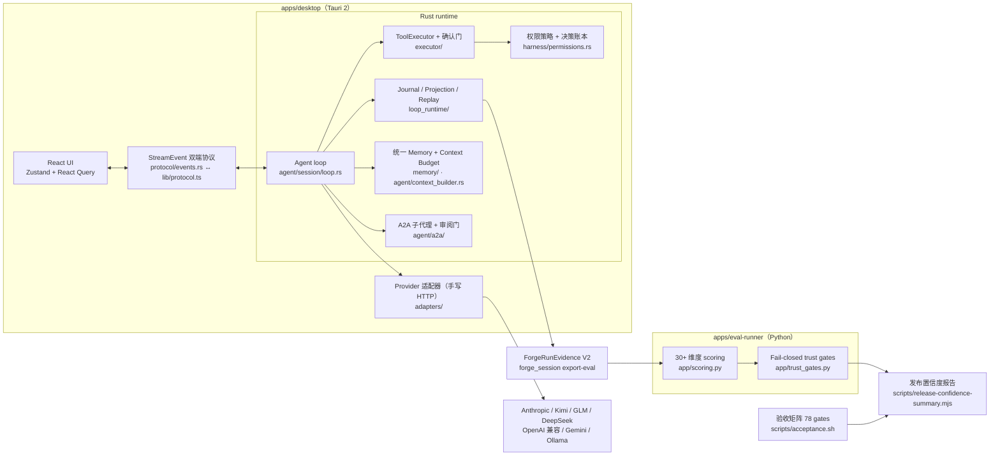

# Forge

Forge 是一个 local-first 的 AI Agent Workbench：把 coding agent 放进一个可审计、可恢复、可持续的本地桌面工作台，并用一套以可信证据为核心的 eval 与验收体系为它护航。

这份 README 同时是仓库的作品导览：

- 想在 30 秒了解全貌 → [仓库地图](#仓库地图)与[架构总览](#架构总览)
- 想直接读核心代码 → [技术导览：值得读的代码](#技术导览值得读的代码)
- 想跑起来验证 → [三条演示路径](#三条演示路径)
- 想知道哪些是真实能力、哪些是明确边界 → [诚实边界](#诚实边界当前状态)

## 仓库地图

| 目录 | 内容 | 技术栈 |
| --- | --- | --- |
| `apps/desktop` | Forge 桌面应用：自研 agent runtime + 工作台 UI | Tauri 2 / Rust（约 12.6 万行）+ React / TypeScript（约 4.9 万行） |
| `apps/eval-runner` | Agent 轨迹评测与回测服务：结构化 trace、分层打分、fail-closed trust gate | Python / FastAPI（约 2.4 万行，230+ 测试） |
| `apps/website` | 产品网站原型 | Vite + React |
| `scripts/` | 验收矩阵、发布置信度、迁移与证据脚本（几乎一对一配 `.test.mjs` 契约测试） | Node.js |
| `release/` + `docs/` | 发布 gate profile / manifest schema、执行计划、运行手册 | — |

三个应用保持独立可运行；共享包只在真实复用出现后才抽取。

三个关键事实（截至 2026-07）：

- **自研 agent runtime，不是 SDK 或 CLI 包装。** `Cargo.toml` 里没有任何 LLM SDK；provider 层是手写 HTTP 适配（Anthropic 兼容族 + OpenAI 兼容族），agent loop、上下文压缩、工具执行、权限门、事件账本全部自建。
- **事件溯源式运行时。** 循环状态由 append-only journal 加投影重建（可 replay），确认、权限、恢复动作都留下可回放证据。
- **fail-closed 的评测与发布。** eval 缺证据算 UNKNOWN 而不是通过；验收矩阵 78 个可执行 gate（`--list-json` 可机读）；发布候选与 gate 结果绑定 commit。

## 架构总览



## 技术导览：值得读的代码

| 想看什么 | 从哪读 |
| --- | --- |
| 前后端事件协议如何保持单一真相 | `apps/desktop/src-tauri/src/protocol/events.rs` ↔ `apps/desktop/src/lib/protocol.ts`，由 `check:protocol` 脚本锁同步 |
| Agent loop 的真实工程问题 | `apps/desktop/src-tauri/src/agent/session/loop.rs`：setup → 单轮执行 → finalize；上下文溢出重试、自动压缩、取消传播、循环卫兵（轮数上限 / 工具循环 / 无进展检测）与恢复建议 |
| 工具执行与人机确认 | `apps/desktop/src-tauri/src/executor/`：高风险操作发 ConfirmAsk 事件并阻塞在 oneshot 上等用户决策 |
| 权限模型 | `apps/desktop/src-tauri/src/harness/permissions.rs`：Allow / Ask / Deny 三态，Manual Confirm / Trust Project / Full Access 三档模式，决策进入可回放账本 |
| 可恢复的运行时 | `apps/desktop/src-tauri/src/loop_runtime/`：append-only journal、投影重建、replay 回归测试、策略与预算 preflight、类型化完成证据 |
| Provider 适配 | `apps/desktop/src-tauri/src/adapters/`：`anthropic.rs` 与 `openai_compatible.rs` 两族手写流式 HTTP，`provider_registry.rs` 注册目录与 transport 路由 |
| 子代理协作 | `apps/desktop/src-tauri/src/agent/a2a/`：worktree 隔离的子任务、父子事件胶囊、审阅门 |
| 动态工作面板 | `apps/desktop/src/components/workpanel/`：首次打开是无标题、无默认选中的选择器，用户只会明确选择审阅、临时终端、预览、文件或聚焦子任务五类对象；打开后以去重的融合对象栏 Tab 呈现。面板与主对话使用无外框的原生分屏和一条分隔线，默认宽度为 40%，按任务保存，分屏可在 34–62% 间调整，窄窗口改为 overlay；主题 light/dark 由整个工作台消费。临时终端只用于最近输出验证，并非嵌入式终端管理器；记忆与 continuity 只作为后台实现上下文，不进入面板导航 |
| 结果优先对话 | `apps/desktop/src/components/chat/`：每轮主路径只保留用户消息、一个实时安全进度和最终结果；思考、工具、Shell、Diff、用量与交付证据在完成后折叠到结果下方的“已完成 · 查看过程”，未处理确认仍会显式打断 |
| 记忆与上下文预算 | `apps/desktop/src-tauri/src/memory/`、`agent/prepared_turn.rs`：统一记忆视图、召回计划与 token 预算分桶；模型用量与上下文余量在 UI 上是两个独立指标 |
| eval 打分与信任门 | `apps/eval-runner/app/scoring.py`、`app/trust_gates.py`、`app/execution.py`：completed 不等于 trusted，缺证据是 UNKNOWN 不是 pass |

## 三条演示路径

### 1. 风险操作的人机确认门

```bash
cd apps/desktop
npm install
npm run tauri dev
```

选择一个本地项目，让 agent 写文件或执行 shell 命令：文件写入、项目脚本、未知命令会弹出确认卡，卡片展示受影响的工作区、动作和后端权限证据；决策进入权限账本，历史可回放。即使在 Full Access 模式下，外部写入与灾难性命令仍然 fail-closed。

没有桌面环境时，可以跑 mock IPC 的产品契约冒烟：

```bash
npm --prefix apps/desktop run test:e2e -- e2e/acceptance.spec.ts -g "permission|confirmation|full access|trust"
```

### 2. 可重放的运行时账本（journal → projection）

```bash
cargo test --manifest-path apps/desktop/src-tauri/Cargo.toml loop_runtime::journal --lib
cargo test --manifest-path apps/desktop/src-tauri/Cargo.toml loop_runtime::replay_tests --lib
# 或一次跑完 runtime 权威 gate：
scripts/acceptance.sh --only "runtime authority fast gate"
```

看点：崩溃或中断后由事件流重建循环状态；`recover_loop_task` 提供类型化恢复动作（mark-interrupted、只读 export-evidence、abandon-orphan、retry-waiting-task）；操作员可用 `forge_trigger clear-stale-session-input --input-id <id>` 清理滞留的网关输入，并留下 `cleared_stale` 证据而不是伪装成正常接收。

### 3. 可信证据的 eval 门禁

```bash
npm run eval:forge:smoke:dry-run   # 无需 API key 的干跑
npm run eval:forge:smoke:real      # 有 key 时的真实端到端 smoke
npm run test:eval                  # eval-runner 完整 pytest
npm run eval:report:latest         # 查看最近一次报告
```

看点：Forge 跑次导出 ForgeRunEvidence 后，eval-runner 按确认正确性、上下文重复、验证存在性、改动文件范围、恢复证据、用量一致性等 30+ 维度打分；trust gate 区分 UNTRUSTED（明确失败）与 UNKNOWN（缺证据），changed-file 以独立文件系统快照为权威而不信任 agent 自报，emitted diff 在全新 fixture 里 replay 验证。

## 开发

```bash
npm run build:desktop
npm run build:website
npm run test:eval
scripts/acceptance.sh --dry-run
```

eval 固定质量套件：

```bash
cd apps/eval-runner
uv sync --frozen --dev
uv run pytest -q
uv run ruff check .
uv run ruff format --check .
uv run mypy app
```

本地 GitNexus CLI 或索引刷新命令用 `node scripts/gitnexus-safe.mjs -- <command>` 包裹（60 秒超时并打印 fallback impact-report 模板；`--print-template` 单独打印模板）。

## 质量门禁与发布纪律

**验收矩阵**（`scripts/acceptance.sh`）：78 个可执行 gate，按权威域（runtime、permission、usage/context、memory、gateway、eval、UI evidence 等）与发布层级（fast-contract、runtime-core、desktop-ui、manual-evidence、full-release）打标，fast-contract 与 runtime-core 为 CI 默认层级。常用入口：

| 命令 | 用途 |
| --- | --- |
| `scripts/acceptance.sh --dry-run` | 打印 gate 计划而不执行 |
| `scripts/acceptance.sh --list-json` | 机读 gate 元数据（域 / 层级 / 运行成本 / 人工证据标记） |
| `scripts/acceptance.sh --only "<label>"` / `--grep "<text>"` | 精确或模糊运行一个 / 一组 gate |
| `scripts/acceptance.sh --ci-default` | 只跑 CI 默认子集 |
| `scripts/acceptance.sh --results-json gate-results.json` | 输出带域 / 层级元数据的 gate 执行结果 |

矩阵、帮助文本与 JSON 输出由 `node --test scripts/acceptance.test.mjs` 契约测试锁定，防止 gate 清单漂移。

**发布置信度**（`node scripts/release-confidence-summary.mjs --markdown --gate-results gate-results.json`）：把验收矩阵、gate 结果与 eval 报告聚合成 PR-ready 的发布置信度报告，包括：

- verified capability evidence：能力声明必须指向真实通过的验收 gate 与 eval 分数；指向缺失或失败的 gate / 分数会报 capability evidence gap。
- gate-results execution completeness 与 execution reason evidence：未执行的 gate 必须带原因。
- acceptance domain/tier breakdowns 与失败 / 人工 / 未知 gate 的 gate detail metadata。
- `--out-dir` 生成 dashboard artifact output；`--ci-default-only` 忽略未提供结果的非 CI gate；`--no-acceptance-matrix` 允许自描述 gate-results 作为唯一验收来源；`--fail-on-attention` 让报告本身表现为门禁并以非零退出。

**eval 发布 gate**：4 个稳定验收标签，任一可用 `scripts/acceptance.sh --only "<label>"` 运行：

```text
eval execution identity baseline
eval independent workspace evidence baseline
eval trusted execution baseline
eval authenticated fenced worker baseline
```

eval CLI 发布跑次只对可信且过阈值的证据返回成功；`--report-only` 可在不把 trust blocker 变成退出门禁的情况下检查不完整证据。

**记忆迁移设计门**：`scripts/memory-migration-dry-run.mjs` 输出只读的 physical store migration dry-run 报告（记录 id 稳定性、archive/forget 语义、召回结果、隐藏体脱敏与回滚计划）；物理迁移明确未开始。

**发布候选**：`release/release-gates.v1.json` 定义 R1–R4 gate profile；`npm run release:candidate` 产出与 commit 绑定的候选 manifest，`npm run release:validate` 校验；schema 与校验逻辑各配契约测试。

## 诚实边界（当前状态）

- Forge 处于 internal beta；CHANGELOG 尚未切正式版本号。
- 桌面 e2e 是 mock IPC 的产品契约冒烟，不是真实模型端到端；真实模型路径走 eval smoke（`eval:forge:smoke:real`）。
- eval 的多数 case 是 contract / mock 证据，验证的是证据契约与 scorer 的正确性，不是大规模模型排行榜；red-team 检查是启发式规则。
- gateway 默认 local ownership：`gateway_can_resume` 保持 false，只读 owner 切片需要显式人工批准或 dev-only flag；commit / merge / push 始终人工把关。
- 不声称：Tauri/WebDriver 强杀恢复、syscall 级追踪、billing 级用量核算（provider 未报 usage 时保持 unknown 而不是编造）、pending 确认 / 工具调用的自动接受。

## 文档地图

| 文档 | 内容 |
| --- | --- |
| [`apps/desktop/README.md`](apps/desktop/README.md) | 桌面产品定位、承诺与体验（含英文版链接） |
| [`apps/eval-runner/README.md`](apps/eval-runner/README.md) | eval 架构、trace 契约与运行方式 |
| [`docs/superpowers/plans/2026-06-12-forge-hermes-runtime-gap-roadmap.md`](docs/superpowers/plans/2026-06-12-forge-hermes-runtime-gap-roadmap.md) | 桌面 runtime 硬化路线图（Phase 1–7，带验收记录） |
| [`docs/release/merge-train-2026-07-10.md`](docs/release/merge-train-2026-07-10.md) | 发布合并列车账本 |
| [`CHANGELOG.md`](CHANGELOG.md) | 全部用户可见运行时变更 |

## Product Tracking

Roadmap 项在私有 GitHub Project 中跟踪：

https://github.com/users/Cabbos/projects/3
