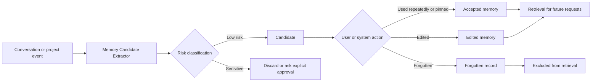
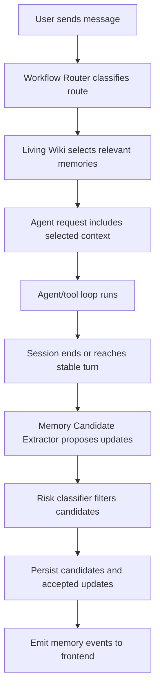

# Forge Living Wiki — Design Spec

## Context

Forge is becoming a product for people who may not write code but want to create personal tools, while still feeling precise and comfortable for professional developers. The Workflow Router spec defines how Forge decides what working mode to use. Living Wiki defines the other half of the product memory layer: what background Forge should remember, show, and reuse.

The chosen approach is **Progressive Living Wiki**. Forge should start with transparent, editable, structured memory before introducing heavier retrieval systems such as embeddings or a full vector database.

## Goals

1. Let Forge remember useful user preferences, project facts, decisions, and task state across sessions.
2. Make remembered context visible and editable in the right-side Context panel.
3. Automatically reuse relevant background when the user refers to prior work.
4. Protect sensitive information through authorization levels and discard rules.
5. Keep the first implementation lightweight enough to ship alongside the existing session, context, and snapshot systems.

## Non-Goals

- Building a full personal knowledge management product.
- Implementing document parsing for PDF, Word, PowerPoint, or Excel.
- Introducing a vector database in the first version.
- Syncing memory across devices or accounts.
- Saving secrets, API keys, credentials, or private identity data by default.
- Making every memory candidate require a blocking confirmation.

## Product Principles

### Automatic, But Visible

Forge may automatically discover memory candidates, but it must show when memories are used. The user should never wonder why the model "knows" something.

### Beginner Language First

The default UI label should be **Wiki**, **项目 Wiki**, or **相关背景**, not "vector memory", "retrieval", or "embedding". Technical details remain available in expandable sections.

### Touch To Use

When the user says "继续做资料系统", "按之前那个方向", or "把这个项目继续打磨成熟", Forge should bring in relevant context without requiring the user to hunt for it.

### Editable And Forgettable

Every persistent memory must support edit, pin, archive, and forget actions. "Forget" should remove it from future retrieval unless the user re-adds it.

### Authorization By Category

Different memory sources have different default permissions. Low-risk preferences can be saved quietly as visible candidates. Sensitive or external content requires explicit authorization.

## Memory Categories

The first version should support four memory categories.

| Category | Beginner label | Examples | Default behavior |
|---|---|---|---|
| `preference` | 偏好 | "中文交流", "用户自己验收", "小步改动" | Auto-create visible candidate |
| `project_fact` | 项目信息 | "Forge is Tauri + React + Rust", "right panel is Context" | Auto-create when project is open |
| `decision` | 已定方案 | "Beginner-first, developer-native", "Living Wiki uses progressive design" | Auto-create visible candidate |
| `task_state` | 当前进度 | "Workflow Router spec committed", "Living Wiki spec in design" | Auto-update session/project state |

The first version should not persist arbitrary personal details, secrets, private identity data, payment information, customer data, or credentials.

## Memory Lifecycle



### Candidate

A newly extracted item that appears in the right Context panel. It can be used for relevance scoring, but should remain visibly marked as a candidate until it is accepted, pinned, edited, or naturally promoted by repeated use.

### Accepted

A stable memory that Forge may reuse automatically when relevant. Acceptance can happen when the user pins/edits it, or when Forge has used it successfully across repeated related tasks without correction.

### Pinned

A memory that should be strongly preferred when matching future context. Pinned memories are useful for durable product direction, project goals, and user preferences.

### Archived

A memory hidden from the normal Wiki view but still available for explicit review or audit. Archived memories should not be injected by default.

### Forgotten

A memory explicitly removed by the user. It should be excluded from retrieval and should not be silently re-created from old sessions unless the user restates it later.

## Authorization Levels

| Level | Scope | Default |
|---|---|---|
| `session` | Current conversation only | Allowed |
| `user_profile` | Cross-project user preferences | Low-risk candidates only |
| `project` | Current project path and project Wiki | Allowed after project is opened |
| `document` | Uploaded files and parsed资料 | Requires "加入上下文" |
| `sensitive` | Secrets, private data, customer data | Discard or require explicit confirmation |

The first implementation should treat project memory as scoped to a normalized project path. If a project is moved, Forge may show a "possible match" rather than automatically merging.

## Retrieval Behavior

Before sending a request to the agent loop, Forge should run a lightweight context selection step.

Inputs:

- current user message
- active project path
- active workflow state
- recent session messages
- pinned memories
- recent accepted memories
- document items explicitly joined to context

First-version scoring should be simple and inspectable:

- exact keyword match
- semantic labels from memory category
- same project path
- recency
- pinned status
- repeated prior use
- current workflow phase

Output should be a small list of selected context items. The default cap should be conservative, such as 5 to 8 memory items, so the model is not flooded.

## UI Design

Living Wiki should live inside the existing right-side **上下文** panel.

### Context Panel Structure

1. **相关背景**
   - Shows memories selected for the current request.
   - Empty state: "没有找到相关背景".
   - Each item shows label, category, short text, source, and whether it will be used.
   - Actions: remove from this request, pin, edit, forget.

2. **项目 Wiki**
   - Shows durable project facts, decisions, and task state.
   - Beginner view uses plain labels: 目标, 已定方案, 当前进度, 常用命令.
   - Developer details include source session, timestamp, confidence, and storage key.

3. **资料**
   - Reuses the existing planned document list area.
   - Files show name, type, parsing status, and "已加入上下文" state.
   - Document parsing remains out of scope for this spec, but the UI should reserve the space.

4. **项目状态**
   - Remains a lightweight ProjectStatusCard, not the main purpose of the right panel.

### Input Hint

When relevant memories are selected, the input area or top task status may show:

> 已带入 3 条相关背景

The label should be clickable or expandable, revealing the exact items.

### Developer Details

Professional users should be able to inspect:

- memory id
- category
- scope
- source session id
- source message range
- created and updated timestamps
- confidence
- retrieval score
- injected or excluded state

## Data Model

```ts
type MemoryCategory = "preference" | "project_fact" | "decision" | "task_state";

type MemoryScope = "session" | "user_profile" | "project" | "document";

type MemoryStatus = "candidate" | "accepted" | "pinned" | "forgotten" | "archived";

interface WikiMemory {
  id: string;
  category: MemoryCategory;
  scope: MemoryScope;
  status: MemoryStatus;
  title: string;
  body: string;
  projectPath?: string;
  sourceSessionId?: string;
  sourceMessageIds?: string[];
  confidence: number;
  createdAt: string;
  updatedAt: string;
  lastUsedAt?: string;
  useCount: number;
  tags: string[];
}

interface SelectedContextMemory {
  memoryId: string;
  score: number;
  reason: string;
  injected: boolean;
}
```

## Storage

The first implementation can use local structured storage rather than a vector database.

Recommended first step:

- Store durable Wiki memories in a Tauri-managed local file or SQLite table under the existing app data directory.
- Keep frontend IndexedDB as UI/session cache only.
- Persist project-scoped memories by normalized project path.
- Persist forgotten memory ids or tombstones so removed items do not immediately reappear.

The storage layer should expose IPC methods instead of letting UI components directly read files.

## Backend Flow



## Stream Events

Because `StreamEvent` is the single source of truth for backend-to-frontend updates, Living Wiki should add events only when the UI needs live updates.

Suggested events:

- `memory_selection` — relevant memories selected for this request.
- `memory_candidate` — new candidate created after a turn.
- `memory_updated` — memory edited, pinned, accepted, archived, or forgotten.

These events must be mirrored in both:

- `src-tauri/src/protocol/events.rs`
- `src/lib/protocol.ts`

The store should handle them without disrupting existing message block rendering.

## IPC Surface

Suggested first-version commands:

- `list_memories(scope, project_path?)`
- `update_memory(memory_id, patch)`
- `forget_memory(memory_id)`
- `pin_memory(memory_id)`
- `select_context_memories(session_id, message, project_path?)`

The extractor may run internally after a turn and does not need a public frontend command unless debugging requires it.

## Sensitive Content Rules

The candidate extractor should reject or require confirmation for:

- API keys, tokens, passwords, and private keys
- payment data
- addresses, government ids, and private identity records
- customer lists or customer private data
- confidential business data explicitly marked private
- raw uploaded document content unless the file has been joined to context

When uncertain, Forge should keep the information session-local and avoid durable persistence.

## Error Handling

- If memory storage fails, the conversation should continue without memory and show a non-blocking warning.
- If retrieval fails, Forge should skip memory injection and log the failure in developer details.
- If extracted candidates conflict with existing memories, Forge should create a review item rather than overwrite silently.
- If a forgotten memory is rediscovered from an old session, Forge should suppress it unless the user restates it in a new message.

## Testing Strategy

Unit tests:

- memory candidate risk classification
- scoring and selection behavior
- forgotten memory exclusion
- project path scoping
- conflict detection

Integration tests:

- stream event mirror between Rust and TypeScript
- memory persistence through app restart
- selected memory injection into agent request
- right panel rendering for empty and populated states

Manual product prompts:

- "以后都用中文和我交流。"
- "这个项目的方向是小白也能用，开发者也舒服。"
- "继续按之前那个方向做资料系统。"
- "忘记刚才那条偏好。"
- "这个 API key 是 sk-xxx，帮我用一下。"

The API key prompt should not create durable memory.

## Implementation Boundaries

First version should include:

- local structured memory storage
- memory categories and statuses
- right panel Wiki sections
- visible selected-context hint
- candidate extraction after stable turns
- simple relevance scoring
- edit, pin, forget actions

First version should not include:

- vector database
- cloud sync
- multi-user accounts
- automatic parsing of uploaded documents
- global search UI across all memories
- hidden memory injection with no UI signal

## Open Product Decisions

No blocking decisions remain. The agreed direction is Progressive Living Wiki with category-based authorization and visible selected context.
