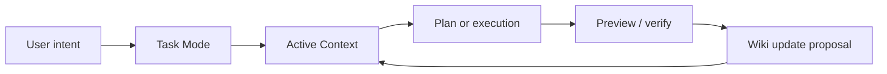
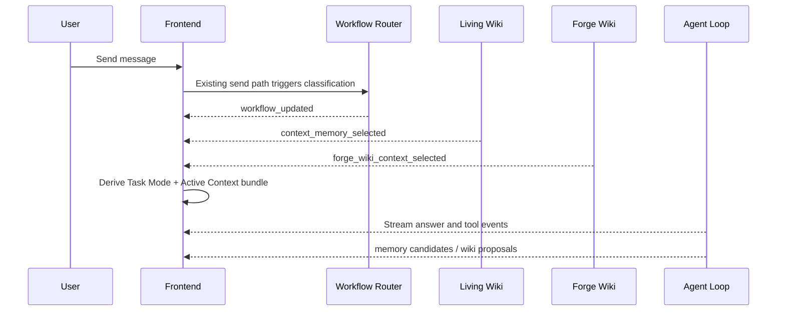

# Forge Task Mode and Context Activation — Design Spec

## Context

Forge now has four important foundations in `main`:

- a more mature Forge shell and right-side **上下文** panel
- a Workflow Router with route, phase, gate, matched signals, and override actions
- Living Wiki memory models, scoring, extraction, persistence, and context selection
- Forge Wiki storage, IPC, proposal review, and selected page injection

The remaining product gap is not another storage layer or another router rule. The gap is that the user does not yet feel a continuous work loop.

Today Forge can decide and remember. The next step is to make those decisions and memories visible at the right moment:

> Forge shows what it is doing, why it is doing it, and what context it is using.

In Chinese product language:

> Forge 不是聊天框，而是会带着用户推进当前任务的工作台。

This spec defines the next product layer: **Task Mode** plus **Context Activation**.

## Product Thesis

The mature product feeling should come from a stable loop:



The user should be able to answer three questions at any moment:

1. Forge 现在在做什么？
2. Forge 这次带入了哪些资料或记忆？
3. 我可以怎样接管、修正、或关闭这些判断？

For beginners, the answer should be visible in plain Chinese. For professional developers, the exact route, phase, injected context, file paths, and debug details should remain inspectable.

## Goals

1. Make Workflow Router state visible as a product-level **Task Mode**.
2. Show active context for the current request, including selected memories, Forge Wiki pages, and future source documents.
3. Let users remove context from the current turn, pin useful context, edit memory candidates, or open developer details.
4. Keep beginner-facing labels calm, direct, and Chinese-first.
5. Preserve developer-native transparency through expandable details.
6. Reuse existing Workflow Router, Living Wiki, Forge Wiki, store, and IPC as much as possible.
7. Avoid building document parsing, embeddings, or a full onboarding wizard in this phase.

## Non-Goals

- Implementing PDF, Word, PowerPoint, or Excel parsing.
- Building a full first-run beginner builder wizard.
- Replacing the existing Workflow Router enum or memory models.
- Creating a visual workflow editor.
- Automatically saving every conversation detail into Wiki.
- Making every small request pass through a heavy planning gate.
- Adding cloud sync or account-level memory.

## Product Principles

### Mode Is A Promise

Task Mode should describe what Forge is about to do, not merely decorate the UI. If the mode says **拆成步骤**, Forge should be planning. If it says **检查结果**, Forge should be verifying.

### Context Must Be Accountable

When Forge uses a memory or Wiki page, the user should be able to see it. The product should avoid hidden "model memory" vibes. The right panel should answer:

- what was selected
- why it matched
- whether it was injected
- how the user can remove or edit it

### Beginner First, Expert Expandable

Default labels should be:

| Internal idea | Beginner-facing label |
|---|---|
| Workflow route | 工作方式 |
| Workflow phase | 当前步骤 |
| Gate | 是否需要确认 |
| Selected memory | 相关背景 |
| Selected Forge Wiki page | 项目记录 |
| Injected context | 本轮已带入 |
| Excluded context | 本轮未使用 |
| Proposal | 建议更新记录 |

Developer details remain available behind an expandable area.

### User Control Beats Automation

Automatic routing and context selection are useful only if the user can correct them. Every visible mode/context decision needs one nearby escape hatch:

- switch task mode
- answer directly
- plan first
- debug
- verify
- remove this context from the current turn
- pin/edit/forget memory
- accept/discard Wiki update

### Small Work Should Stay Small

Task Mode must not turn every copy edit into a ceremony. `direct` and `light` routes should stay fast. The visible UI should inform the user without blocking them.

## Task Mode Model

Task Mode is a display layer derived from existing `WorkflowState`.

The first version should not add a new backend enum. It should map `WorkflowRoute`, `WorkflowPhase`, and `WorkflowGate` into stable UI labels. A future version may persist a separate task object when Forge supports multi-step project boards.

### Display Modes

| Display mode | Chinese label | Derived from | User meaning |
|---|---|---|---|
| `ready` | 准备判断 | `idle`, `classifying` | Forge is deciding how to handle the request. |
| `clarify` | 梳理想法 | `clarifying`, `designing` | Forge is turning a vague idea into a clear direction. |
| `spec` | 确认方案 | `spec`, `strict_workflow` with approval gate | Forge needs a visible design or user approval before implementation. |
| `plan` | 拆成步骤 | `planning` | Forge is turning the solution into executable steps. |
| `build` | 开始制作 | `executing`, `light` | Forge is changing files or running tools. |
| `debug` | 排查问题 | `debugging`, `recovery`, `blocked` | Forge is investigating a failure or blocked state. |
| `verify` | 检查结果 | `verifying`, `verification` | Forge is running checks or reviewing output. |
| `wrap` | 整理结果 | `done` | Forge is summarizing outcome and next steps. |

### Mode Copy

Each display mode should have short, stable copy:

| Mode | Primary text | Supporting text |
|---|---|---|
| 准备判断 | 正在判断工作方式 | Forge 会根据你的请求选择直接回答、规划、执行或排查。 |
| 梳理想法 | 正在把想法整理清楚 | 适合新功能、产品方向、需求还不完整的任务。 |
| 确认方案 | 先确认方案再继续 | 这个任务可能影响多个部分，建议先看方案。 |
| 拆成步骤 | 正在拆成可执行步骤 | Forge 会把方案变成小步任务，便于执行和验证。 |
| 开始制作 | 正在处理项目 | Forge 可能会读写文件、运行命令或更新界面。 |
| 排查问题 | 正在定位问题 | Forge 会先收集症状，再做有依据的修复。 |
| 检查结果 | 正在检查结果 | Forge 会跑构建、测试或查看关键状态。 |
| 整理结果 | 正在整理完成情况 | Forge 会说明改了什么、验证了什么、还剩什么。 |

### Override Actions

The existing override actions should be exposed in beginner language:

| Existing action | UI label | Behavior |
|---|---|---|
| `direct` | 直接回答 | Force the next response to skip planning if safe. |
| `plan_first` | 先拆方案 | Force a planning/spec path before code changes. |
| `debug` | 排查问题 | Treat the next request as a debugging workflow. |
| `verify` | 检查结果 | Treat the next request as verification/review. |

The UI should show these as compact text actions or a small menu, not as a large mode switcher. Beginners should not need to learn a workflow system before making progress.

## Context Activation Model

Context Activation is the user-visible bundle of context selected for the current request.

It is not a new storage layer. It is a presentation and control layer over existing selected context:

- `selectedContextBySession`: Living Wiki memory selections
- `forgeWikiContextBySession`: Forge Wiki page selections
- future document source selections from the **资料** area

### Active Context Item

The UI should normalize different context sources into a shared shape:

```ts
type ActiveContextKind = "memory" | "forge_wiki_page" | "source";

interface ActiveContextItem {
  id: string;
  kind: ActiveContextKind;
  title: string;
  summary: string;
  reason: string;
  injected: boolean;
  score?: number;
  sourceLabel: string;
  sourcePath?: string;
  tokenEstimate?: number;
  actions: ActiveContextAction[];
}

type ActiveContextAction =
  | "remove_from_turn"
  | "pin"
  | "edit"
  | "forget"
  | "open"
  | "join_context"
  | "leave_context";
```

The first implementation can compute this in the frontend from existing store data. A backend `context_activation_updated` event can be deferred until document sources and token budgeting become richer.

### Activation States

| State | Label | Meaning |
|---|---|---|
| `empty` | 本轮没有带入额外背景 | No memory, Wiki page, or source was selected. |
| `selected` | 找到相关背景 | Items matched but may not all be injected. |
| `injected` | 本轮已带入 | Items were included in the request context. |
| `excluded` | 本轮未使用 | Items matched but were excluded by user action, status, or token limits. |
| `stale` | 背景可能过期 | A selected item points to old task state or old project path. |

The first version should focus on `empty`, `selected`, and `injected`.

### Selection Reasons

Reasons should be plain and specific:

- 匹配到当前项目路径
- 匹配到“右侧上下文”相关关键词
- 这是你固定的偏好
- 这是最近的项目决策
- 这是当前任务状态
- 这页项目记录与本轮请求相关

Developer details may include exact score, memory id, page id, route, phase, and source session id.

## Right Panel Information Architecture

The right-side **上下文** panel should become the user's current work surface.

Recommended order:

1. **当前任务**
   - Derived Task Mode card.
   - Shows current mode, short reason, gate, and compact override actions.
   - Developer details stay collapsed.

2. **本轮上下文**
   - Shows active memories, Forge Wiki pages, and future document sources selected for this turn.
   - Empty state: `本轮没有带入额外背景`.
   - Summary line: `已带入 3 条背景`.
   - Each item shows title, type, reason, injected state, and small actions.

3. **建议更新记录**
   - Shows pending memory candidates and Forge Wiki update proposals.
   - User can accept, edit, ignore, or discard.
   - This section is the Memory Inbox.

4. **项目 Wiki**
   - Shows durable Wiki pages and accepted/pinned project memories.
   - This is browsable context, not necessarily active in the current turn.

5. **资料**
   - Keeps the future file list area.
   - Shows file name, type, parse status, and joined-to-context state.
   - Empty state: `还没有添加资料`.

6. **项目状态**
   - Remains a lightweight `ProjectStatusCard`.
   - It should not dominate the panel.

This order keeps the panel focused on what affects the current answer first, then durable project knowledge, then raw sources and project status.

## Top-Level UI

Task Mode should also appear outside the right panel so users can understand Forge's state even when the panel is closed.

Recommended placement:

- a compact pill near the session header or input area
- label: current mode, such as `梳理想法`
- secondary text or tooltip: `已带入 3 条背景`
- clicking opens the right **上下文** panel and scrolls to **当前任务** or **本轮上下文**

The top-level indicator should stay small. It is a status affordance, not a hero component.

## Input Bar Behavior

The input bar can use mode-aware hints without becoming noisy.

Examples:

| Mode | Placeholder |
|---|---|
| 准备判断 | 说说你想做什么，Forge 会判断下一步。 |
| 梳理想法 | 描述目标、使用者、输入和输出。 |
| 确认方案 | 看完方案后，可以说“开始做”或指出要改哪里。 |
| 拆成步骤 | 可以补充约束，或说“按这个计划执行”。 |
| 开始制作 | 可以继续描述修改，Forge 会处理项目。 |
| 排查问题 | 粘贴报错、失败现象或复现步骤。 |
| 检查结果 | 说要检查什么，或让 Forge 跑构建/测试。 |

Mode-aware hints should not replace user control. Advanced users can still type direct commands.

## Memory Inbox

The current Wiki sections already show candidates and proposals. This spec formalizes them as **建议更新记录**.

### Inbox Items

The inbox should include:

- Living Wiki memory candidates
- Forge Wiki update proposals
- future source-derived summary proposals

Each item should show:

- title
- short body or summary
- why Forge suggested it
- scope: 当前会话, 当前项目, 用户偏好, 资料
- actions: 接受, 编辑, 忽略, 忘记 or 丢弃

### Acceptance Rules

- Low-risk preferences may appear as visible candidates.
- Project facts and decisions may appear as visible candidates.
- Secrets, API keys, credentials, tokens, and private personal data must not become normal candidates.
- If the user says `不要记住`, `只是临时测试`, or similar, the request should suppress durable memory proposals for that turn.
- Forgotten memories should not be silently re-created from old sessions.

## Interaction Examples

### Beginner Tool Request

User:

> 我想做一个记账小工具，但我不会写代码

Expected behavior:

- Task Mode: `梳理想法`
- Context Activation: includes relevant user preference such as Chinese language and beginner-first mode if available.
- Right panel explains why Forge is asking clarifying questions.
- Forge asks a small number of product questions before implementation.

### Continue Previous Work

User:

> 继续上次那个上下文面板方向

Expected behavior:

- Task Mode: `拆成步骤` or `开始制作`, depending on recent state.
- Active Context: recent decisions and Wiki pages about right-side context panel.
- Top indicator: `已带入 N 条背景`.
- Right panel lists the exact memories/pages used.

### Temporary Sensitive Test

User:

> 不要记住这个 API key，只是临时测试：sk-1234567890

Expected behavior:

- Task Mode: `直接回答` or `排查问题`, depending on request.
- No persistent memory candidate is created for the key.
- Active Context may show no durable context.
- If a safety notice is shown, it should be concise and not preachy.

### Developer Verification

User:

> 跑一下 build，确认合并后的 main 没问题

Expected behavior:

- Task Mode: `检查结果`
- Active Context: current project path and maybe recent PR/Wiki status.
- Forge runs the appropriate verification command.
- Completion summary includes evidence.

## Data Flow

### Current First-Version Flow



### Future Flow

A future backend event can provide a canonical activation ledger:

```ts
interface ContextActivationUpdated {
  event_type: "context_activation_updated";
  session_id: string;
  request_id: string;
  items: ActiveContextItem[];
  token_estimate: number;
  injected_count: number;
  excluded_count: number;
  updated_at: number;
}
```

This should wait until token budgeting, source documents, and document parsing exist. The immediate implementation can derive the bundle in the frontend.

## Error Handling

### Context Load Failure

If memory or Wiki state fails to load:

- show a compact inline error in the right panel
- keep the current conversation usable
- avoid blocking direct answers
- provide a refresh action

Beginner copy:

> 相关背景暂时读取失败，可以继续对话。

Developer details:

- IPC command name
- error message
- project path

### Stale Context

If selected context belongs to a different project path or old session:

- do not inject automatically
- show it as `可能过期`
- allow the user to manually open or re-attach it

### Wrong Mode

If the router picked a mode the user dislikes, the user can say:

- `直接回答`
- `先别写代码，先规划`
- `这是排查问题`
- `帮我验证`

The UI should expose the same actions in the Task Mode card.

## Acceptance Prompts

These prompts should be used when validating the feature manually:

1. `我想做一个记账小工具，但我完全不会写代码`
   - Expect mode: 梳理想法
   - Expect context: beginner/user preferences if available

2. `继续上次那个 Forge Wiki 方向，把它做得更像产品`
   - Expect mode: 梳理想法 or 拆成步骤
   - Expect context: Forge Wiki / moat / product direction entries

3. `不要记住这个，只是临时测试：sk-1234567890abcdefghijkl`
   - Expect no durable memory candidate containing the key

4. `直接回答，不要改文件：auto compact 是什么？`
   - Expect mode: 直接回答 / ready-direct
   - Expect no implementation gate

5. `跑一下 npm run build，确认 main 没问题`
   - Expect mode: 检查结果
   - Expect verification evidence in the response

6. `这个预览打不开，帮我看下`
   - Expect mode: 排查问题
   - Expect systematic debugging path

7. `以后这个项目的 UI 都尽量深色、克制、紧凑`
   - Expect memory candidate: preference or project decision
   - Expect visible candidate in 建议更新记录

8. `这条不要作为长期偏好`
   - Expect no persistent memory candidate, or candidate clearly excluded

## Implementation Slices

This spec should be implemented as small PRs:

### Slice 1: Task Mode Derivation

- Add a frontend helper that maps `WorkflowState` into a stable display mode.
- Update `CurrentTaskCard` to use the display mode copy and override actions.
- Add focused tests for the mapping.

### Slice 2: Active Context Bundle

- Add a frontend helper that combines selected memories and selected Forge Wiki pages.
- Render a new **本轮上下文** section in the right panel.
- Preserve existing memory and Forge Wiki controls.

### Slice 3: Top-Level Indicator

- Add a compact mode/context pill near the session header or input.
- Clicking it opens the right context panel.
- Keep layout stable when the right panel is closed.

### Slice 4: Memory Inbox Polish

- Rename candidate/proposal grouping to **建议更新记录**.
- Make actions and empty states consistent.
- Add explicit copy for "do not remember" suppression behavior when available.

### Slice 5: Acceptance Prompt Coverage

- Extend frontend e2e coverage for right panel rendering and mode labels.
- Add backend unit coverage for context suppression and routing behavior if the existing APIs expose enough hooks.

## Success Criteria

This phase is successful when:

- a user can always see Forge's current working mode
- the right panel shows what context is active for the current turn
- memory candidates and Wiki proposals feel like a visible inbox, not hidden automation
- beginners see plain Chinese labels first
- developers can expand exact route, phase, scores, ids, paths, and reasons
- `direct` and `light` requests remain fast and low ceremony
- no new document parsing, vector database, or onboarding wizard is required

## Deferred Decisions

The following decisions are intentionally deferred:

- whether Task Mode becomes a persistent task board object
- whether context activation needs a backend event
- how uploaded PDF, Word, PowerPoint, and Excel documents produce source summaries
- how token budgeting should choose between memories, Wiki pages, and documents
- whether external Obsidian vaults should be supported as Forge Wiki storage

The default for this phase is conservative: derive from existing state, expose clearly, and avoid new storage complexity.
