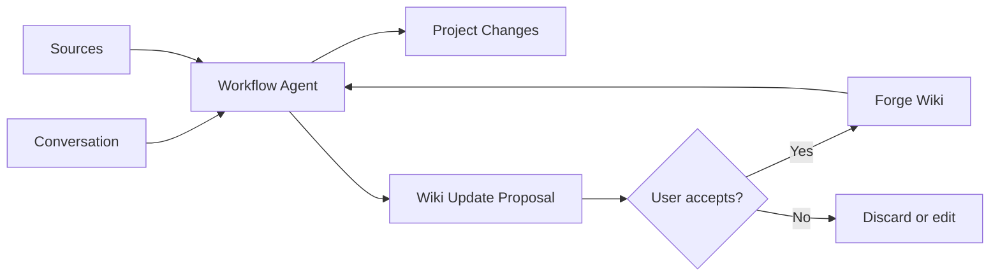

# Forge Wiki — Moat Design Spec

## Context

Forge has already moved beyond a plain chat shell. It now has provider selection, context length visibility, auto compact, basic resume, Context Memory, and a Workflow Router. The next product step should focus on the moat identified in product discussion:

> Forge turns conversations into durable project intelligence.

In Chinese product language:

> Forge 把对话变成项目资产。

This spec defines **Forge Wiki**, the long-lived project knowledge layer that sits between raw sources and the agent execution loop. It is inspired by the LLM Wiki direction described by Andrej Karpathy, but adapted for Forge's local desktop, coding-agent, and beginner-first product shape.

## Product Thesis

The durable moat is not model access, provider coverage, a prettier chat UI, or basic file parsing. Those are important table stakes.

Forge's durable advantage should be that the more a user works with it, the more the project accumulates reusable intelligence:

- what the project is
- what the user wants
- what decisions were made
- what directions were rejected
- what commands work
- what errors happened
- what fixes were tried
- what files and sources matter
- where the next session should resume

The product loop should become:



The user should feel that every meaningful session leaves the project more understandable than before.

## Goals

1. Establish Forge Wiki as the main long-term knowledge artifact for each project.
2. Separate raw sources, structured memory, and durable wiki pages.
3. Make Wiki pages plain Markdown so they are inspectable, editable, diffable, and git-friendly.
4. Let the agent read relevant Wiki pages before doing work.
5. Let the agent propose Wiki updates after meaningful work, with user-visible review before persistence.
6. Keep beginner language simple while preserving developer-grade transparency.
7. Make this foundation compatible with future PDF, Word, PowerPoint, Excel, webpage, and chat-history ingestion.

## Non-Goals

- Building a full Obsidian clone inside Forge.
- Building vector search or embedding infrastructure in the first phase.
- Automatically rewriting Wiki pages without a visible proposal.
- Parsing every document format in the first phase.
- Syncing Wiki data across devices or accounts.
- Replacing git, docs, or the user's existing knowledge base.
- Storing secrets, credentials, or private identity data in Wiki pages.

## Core Product Principles

### Wiki, Not Hidden Memory

Forge Wiki should be visible project knowledge, not hidden model memory. Users should be able to open the files, read them, edit them, and understand why Forge knows something.

### Sources Are Preserved

Raw sources are not the Wiki. Uploaded documents, project files, web pages, and chat transcripts should remain sources with metadata. The Wiki is the curated interpretation layer that points back to those sources.

### Every Update Is Reviewable

Forge may draft Wiki updates automatically, but durable writes should be reviewable. The default user experience should be:

1. Forge proposes what changed.
2. User sees a short summary and optional diff.
3. User accepts, edits, or discards.

This is important for trust. It also makes Forge comfortable for professional developers.

### Beginner-First Language

Primary UI labels should say:

| Technical idea | Product label |
|---|---|
| Wiki page retrieval | 相关项目资料 |
| Wiki write proposal | 建议更新项目记录 |
| Source ingestion | 添加资料 |
| Provenance | 来源 |
| Diff | 改了哪些记录 |
| Schema | 记录规则 |
| Context injection | 本轮带入 |

Developer details can still show paths, page ids, routing scores, source ids, and diffs.

### Touch To Use

The user should not need to manually search the Wiki during normal flow. If they say "继续按之前的方向做" or "这个项目现在做到哪了", Forge should bring in the relevant pages and show that it did so.

## Conceptual Architecture

Forge should use three distinct layers.

### 1. Sources

Sources are raw or near-raw inputs. Examples:

- project files
- uploaded PDF, Word, PowerPoint, Excel, Markdown, text files
- pasted notes
- web pages
- conversation transcripts
- command output and build logs

Sources should be stored as references plus metadata first. Heavy parsing can arrive incrementally.

Source metadata should include:

- source id
- name
- type
- path or origin
- added time
- parse status
- joined-to-context state
- last used time
- source hash when available

### 2. Context Memory

The existing Living Wiki MVP should be repositioned as **Context Memory**.

It stores small, structured, frequently reused facts:

- user preferences
- project preferences
- current task state
- stable project facts
- recent decisions

Context Memory is useful for fast selection and lightweight personalization, but it should not pretend to be the whole Wiki.

### 3. Forge Wiki

Forge Wiki is the durable Markdown knowledge base for a project.

It should live in the project by default:

```text
.forge/
  wiki/
    index.md
    schema.md
    sources.md
    decisions.md
    tasks.md
    log.md
```

This default path makes the Wiki local, reviewable, and git-friendly. A future setting can allow external storage such as an Obsidian vault.

## Default Wiki Pages

### `index.md`

Purpose: project overview and navigation.

Should contain:

- project summary
- current goal
- important links to other Wiki pages
- last updated timestamp
- open questions

### `schema.md`

Purpose: local rules for how Forge maintains this Wiki.

Should contain:

- page types
- naming rules
- what may be stored
- what must not be stored
- update policy
- source citation style
- review requirements

The agent should read `schema.md` before proposing Wiki updates.

### `sources.md`

Purpose: index of known sources.

Should contain:

- uploaded files
- important project files
- linked external references
- parse status
- whether the source is allowed in context

### `decisions.md`

Purpose: durable product and engineering decisions.

Should contain:

- decision title
- date
- context
- selected direction
- rejected alternatives
- reason
- follow-up impact

### `tasks.md`

Purpose: current project progress.

Should contain:

- active objective
- completed milestones
- current branch or workspace notes
- next recommended tasks
- blockers

### `log.md`

Purpose: chronological working log.

Should contain:

- session summaries
- important commands run
- verification results
- links to changed files or commits
- notable failures and fixes

## First-Phase User Experience

### Empty State

When no Wiki exists for a project, the Context panel should show:

> 还没有项目 Wiki

Primary action:

> 建立项目 Wiki

Secondary copy:

> Forge 会创建一组 Markdown 项目记录，后续工作会优先参考它们。

### Initialization

When the user initializes Forge Wiki, Forge should:

1. Create `.forge/wiki/`.
2. Create the six default pages.
3. Fill them with safe starter content.
4. Avoid scanning secrets or large generated directories.
5. Show a success message with the created pages.

Safe starter content may use:

- repo name
- current branch
- existing `AGENTS.md`
- `README.md` when present
- package metadata such as `package.json` or `Cargo.toml`
- recent Forge session summary if available

### During A Request

Before sending work to the agent, Forge should select relevant Wiki pages.

Selection inputs:

- current user message
- current workflow route
- active project path
- pinned Context Memory
- recent Context Memory
- Wiki page titles and summaries
- current task page

The UI should show:

> 已带入 3 页项目记录

Expanding it should show page names and paths.

### After Meaningful Work

After work that changes product direction, implementation state, debugging knowledge, or verification status, Forge should create a Wiki update proposal.

Examples:

- "将今天的产品方向写入 `decisions.md`"
- "将本次构建通过情况追加到 `log.md`"
- "将下一步建议更新到 `tasks.md`"

The first phase can store the proposal in frontend state or a local pending file. It does not need a sophisticated editor.

## Workflow Integration

Forge Wiki should work with the existing Workflow Router.

| Route | Wiki behavior |
|---|---|
| `direct` | Read relevant pages only when the question references project history or status |
| `light` | Read `tasks.md`, `index.md`, and directly relevant pages |
| `workflow` | Read `index.md`, `decisions.md`, `tasks.md`, and `schema.md`; propose updates after plan/spec decisions |
| `strict_workflow` | Require Wiki update proposals for decisions and migration notes |
| `recovery` | Read `log.md`, prior failure notes, commands, and environment details |
| `verification` | Read `tasks.md` and `log.md`; propose verification result updates |

## Relationship To Context Memory

Context Memory should support Forge Wiki, not compete with it.

Recommended split:

| Need | Storage |
|---|---|
| "User prefers Chinese" | Context Memory |
| "Forge is beginner-first, developer-native" | Forge Wiki decision, optionally mirrored as Context Memory |
| "Current branch is ahead 31 commits" | `tasks.md` or `log.md` |
| "API key was pasted" | Store nowhere |
| "This PDF was uploaded" | Source metadata |
| "The PDF implies a product requirement" | Wiki proposal referencing the source |

Context Memory can help decide which Wiki pages to load. Wiki pages should remain the durable source of project knowledge.

## Data Model

First-phase backend types can stay lightweight.

```ts
type WikiPageKind =
  | "index"
  | "schema"
  | "sources"
  | "decisions"
  | "tasks"
  | "log"
  | "custom";

interface ForgeWikiPage {
  id: string;
  project_path: string;
  path: string;
  title: string;
  kind: WikiPageKind;
  summary?: string;
  updated_at?: string;
  token_estimate?: number;
}

interface ForgeWikiSource {
  id: string;
  project_path: string;
  name: string;
  source_type: "project_file" | "upload" | "web" | "conversation" | "command_output";
  path_or_origin: string;
  parse_status: "unparsed" | "parsed" | "failed";
  joined_to_context: boolean;
  added_at: string;
  last_used_at?: string;
}

interface ForgeWikiUpdateProposal {
  id: string;
  project_path: string;
  target_pages: string[];
  title: string;
  summary: string;
  patch_preview?: string;
  status: "pending" | "accepted" | "edited" | "discarded";
  created_at: string;
}
```

Rust and TypeScript definitions must remain synchronized if these become stream events or IPC return types.

## IPC Surface

The first implementation should expose small, explicit commands:

- `get_forge_wiki_state(project_path)`
- `init_forge_wiki(project_path)`
- `list_forge_wiki_pages(project_path)`
- `read_forge_wiki_page(project_path, page_path)`
- `select_forge_wiki_context(project_path, message, workflow_state?)`
- `create_forge_wiki_update_proposal(project_path, session_id, summary)`
- `accept_forge_wiki_update_proposal(project_path, proposal_id)`
- `discard_forge_wiki_update_proposal(project_path, proposal_id)`

The exact command names can follow local Rust handler style during implementation, but the responsibilities should stay separate.

## Stream Events

Add stream events only when the UI needs live updates.

Recommended events:

- `forge_wiki_context_selected`
- `forge_wiki_update_proposed`
- `forge_wiki_updated`

These events should include `session_id` when tied to a session.

## Safety Rules

Forge Wiki must avoid writing sensitive content.

Never write:

- API keys
- tokens
- passwords
- private keys
- `.env` values
- customer data
- payment data
- personal identity data unless explicitly authorized

Do not scan by default:

- `.git/`
- `node_modules/`
- `dist/`
- `build/`
- `target/`
- `.next/`
- binary files
- large generated files
- files matching secret-like names

If a Wiki update proposal might contain sensitive content, Forge should discard it or ask explicit confirmation depending on severity.

## Error Handling

- If Wiki initialization fails, conversation should continue and the UI should show a non-blocking error.
- If a page cannot be read, skip that page and show it in developer details.
- If Wiki context selection fails, fall back to Context Memory and normal session history.
- If a proposal cannot be written, keep it visible in the current session so the user can retry.
- If the Wiki path is dirty or externally edited, prefer reading fresh content before applying an accepted proposal.

## Testing Strategy

Unit tests:

- safe path creation
- default page generation
- ignored directory filtering
- sensitive content rejection
- page selection scoring
- proposal lifecycle

Integration tests:

- initialize Wiki for a project
- select pages before a workflow request
- create and accept a Wiki update proposal
- ensure discarded proposals do not write files
- ensure missing or corrupt Wiki files do not break conversation

Frontend tests:

- Context panel empty state
- initialize Wiki action
- selected Wiki pages display
- pending Wiki proposal display
- accept and discard proposal actions
- no text overflow in the right panel

## Phase 1 Scope

The first implementation should include:

1. `.forge/wiki/` initialization.
2. Six default Markdown pages.
3. Safe project metadata extraction.
4. IPC for state, init, list, read, select.
5. Agent context selection from Wiki pages.
6. Right Context panel Wiki section.
7. Basic Wiki update proposal creation after meaningful work.
8. Accept and discard proposal actions.
9. Tests for storage, safety, selection, and UI state.

## Later Phases

Later phases can add:

- richer document parsing
- source-to-Wiki ingestion flows
- backlinks between Wiki pages
- page-level provenance
- Obsidian vault export or sync
- embeddings for page discovery
- visual Wiki map
- cross-project user knowledge
- team/shared Wiki mode

## Acceptance Criteria

Forge Wiki Phase 1 is successful when:

1. A user can initialize a project Wiki from the Context panel.
2. The Wiki appears as real Markdown files under `.forge/wiki/`.
3. Forge can show which Wiki pages were brought into a request.
4. After meaningful work, Forge can propose a Wiki update instead of silently writing hidden memory.
5. The user can accept or discard the proposal.
6. Sensitive content is not written to Wiki pages by default.
7. Professional developers can inspect paths and diffs.
8. Non-coding users can understand the primary labels without knowing RAG, embeddings, or context injection.

## Open Product Decisions

No blocking decisions remain for Phase 1. The following choices can remain configurable or deferred:

- Whether a future version lets users choose Obsidian as the primary Wiki location.
- Whether accepted Wiki proposals should create git checkpoints automatically.
- Whether document parsing should generate proposals immediately or only after the user asks a question about the document.

