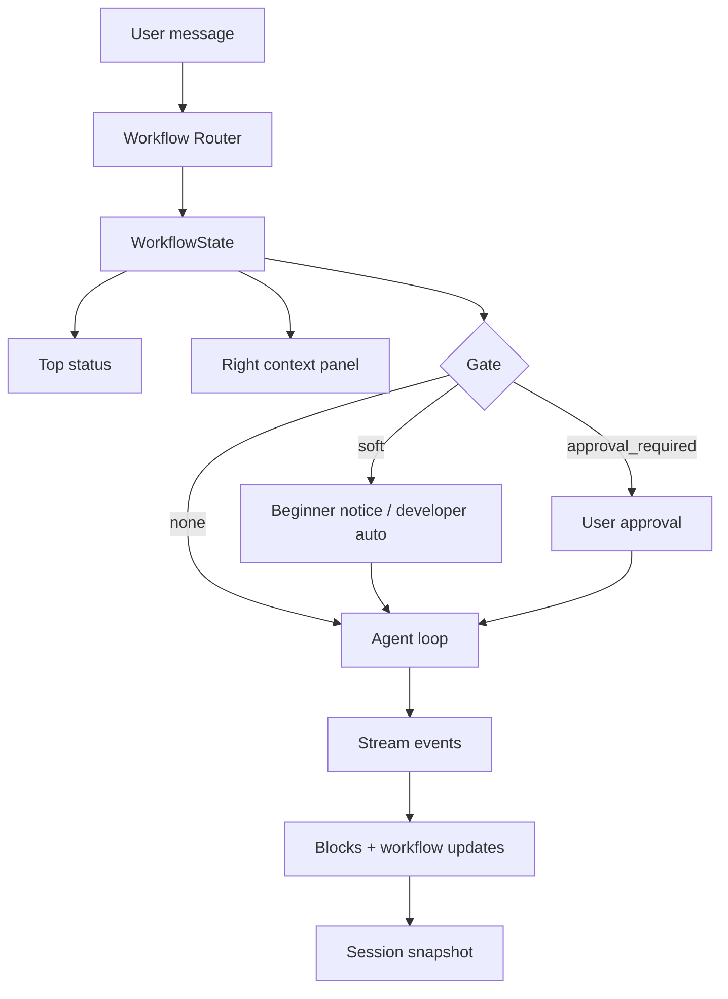

# Forge Workflow Router — Design Spec

## Context

Forge is moving from a coding-agent demo toward a product that helps someone who cannot code turn an idea into a usable personal tool. At the same time, professional developers should still feel fast and in control. The product direction agreed in brainstorming is:

- **Beginner-first, developer-native**: ordinary language by default, real technical detail available on demand.
- **Primary loop**: from one idea to a working web tool, with preview, rollback, and acceptance.
- **Professional base**: existing project modification remains a first-class path, exposed through details, command palette, logs, diffs, and checkpoints.
- **Workflow method**: Superpowers-style discipline should be built in as Forge's work style, not shown as a raw list of skills.

This spec defines the built-in Workflow Router that decides, from conversation intent and task context, whether Forge should answer directly, make a lightweight change, enter a planning workflow, or switch into recovery/debugging.

## Goals

1. Let Forge automatically choose an appropriate workflow from user intent.
2. Translate Superpowers concepts into normal product language for beginners.
3. Preserve expert visibility into the real workflow, matched rules, logs, plans, diffs, and verification.
4. Avoid blocking every small task with heavy planning.
5. Make workflow state visible in the top task status and explainable in the right context panel.

## Non-Goals

- Building the template gallery or first-run creation wizard.
- Implementing document parsing for PDF, Word, PowerPoint, or Excel.
- Replacing the existing provider/model system.
- Building a full visual workflow editor.
- Requiring every request to follow strict spec/plan/verify gates.

## Product Principles

### Beginner Language First

The default UI should not say `brainstorming`, `checkpoint`, `context window`, `tool call`, or `diff` as the primary label. It should say:

| Technical concept | Beginner label |
|---|---|
| Brainstorming | 梳理想法 |
| Spec | 方案 |
| Plan | 步骤 |
| Execute | 开始制作 |
| Verification | 检查结果 |
| Checkpoint | 保存修改前状态 |
| Diff | 改了哪些地方 |
| Context | 资料 |
| Tool call | 正在处理项目 |

Expert details remain available through expandable sections.

### Developer-Native Depth

Professional developers need real handles:

- workflow id and phase
- matched routing rules
- provider/model/context length
- spec and plan file paths
- tool logs and shell commands
- git checkpoint id, HEAD, and patch
- diff and file references
- retry and failure cause

The product should hide none of this; it should merely avoid making it the first thing a beginner sees.

## Workflow Router

The Workflow Router runs before each user request is sent to the agent loop. It uses the current message, session state, project state, and recent workflow state to choose one route.

### Route Types

| Route | Beginner meaning | Developer meaning | Default gate |
|---|---|---|---|
| `direct` | 直接回答 | answer only, no tools needed | no gate |
| `light` | 小改动，直接处理 | low-risk implementation | no gate |
| `workflow` | 先拆清楚再做 | brainstorm/spec/plan workflow | soft gate |
| `strict_workflow` | 必须先确认方案 | high-risk or architecture workflow | approval gate |
| `recovery` | 遇到问题，先排查 | systematic debugging/retry | no gate |
| `verification` | 检查结果 | verification-before-completion | no gate |

### Matching Signals

The router combines explicit keywords with semantic categories. It should produce a readable explanation, not just a hidden enum.

#### Direct

Examples:

- "这个文件是做什么的？"
- "解释一下 auto compact 是什么。"
- "我现在做到哪了？"

Signals:

- asks for explanation or status
- no requested file changes
- no new product behavior

#### Light

Examples:

- "把这个按钮文案改成开始制作。"
- "右侧标题换成资料。"
- "这个卡片颜色淡一点。"

Signals:

- one or two files likely affected
- low-risk UI copy or styling
- no data model, deletion, permissions, or architecture change

#### Workflow

Examples:

- "我想做一个记账小工具。"
- "给这个产品设计资料分析能力。"
- "把小白和专业开发者都兼容掉。"

Signals:

- new feature or product behavior
- unclear requirements
- multiple components likely affected
- user is shaping product direction

Default behavior:

- Beginner mode: show a soft prompt: "这个需求会影响多个部分，我先帮你梳理方案。"
- Developer mode: enter workflow automatically and show status only.

#### Strict Workflow

Examples:

- "重构整个 agent loop。"
- "把权限系统重做。"
- "删除旧的 session 存储并迁移到新格式。"

Signals:

- destructive operation
- data persistence or migration
- security/permission changes
- large refactor
- changes to execution sandbox or shell permissions

Default behavior:

- Requires an explicit user approval before implementation.
- Produces or updates a spec and plan before code changes.

#### Recovery

Examples:

- "构建失败了。"
- "工具卡住了。"
- "上下文超限了。"
- "为什么预览打不开？"

Signals:

- error, failure, timeout, stuck, broken, cannot open
- provider/API error
- tool execution failure
- build or runtime failure

Default behavior:

- Use systematic debugging.
- Gather symptoms and reproduction path.
- Classify the failure.
- Suggest or run a targeted fix.

#### Verification

Examples:

- "帮我验收一下。"
- "确认这个改动没有问题。"
- "跑一下检查。"

Signals:

- asks to verify, review, test, check, validate
- recent implementation exists

Default behavior:

- Run the appropriate verification path.
- Report what was checked and what remains unverified.

## Superpowers Integration

Forge should include Superpowers as an internal methodology pack, not as a user-facing plugin list.

### Built-In Workflow Pack

The pack contains the equivalent of these Superpowers workflows:

- `using-superpowers`
- `brainstorming`
- `writing-plans`
- `executing-plans`
- `subagent-driven-development`
- `systematic-debugging`
- `test-driven-development`
- `verification-before-completion`
- `finishing-a-development-branch`

Forge may store the original skill text as bundled resources, subject to the MIT license notice. The UI should expose them as friendly workflow names:

| Internal workflow | Beginner-facing label |
|---|---|
| `brainstorming` | 梳理想法 |
| `writing-plans` | 拆成步骤 |
| `executing-plans` | 开始制作 |
| `systematic-debugging` | 排查问题 |
| `verification-before-completion` | 检查结果 |
| `finishing-a-development-branch` | 整理完成 |

### License Handling

Superpowers is MIT licensed. If bundled, Forge must include the copyright and license text in:

- app acknowledgements/about screen
- repository third-party notices or license document
- packaged app resources if the skill text ships with the app

## Workflow State Model

Each session may have one active workflow.

```ts
type WorkflowRoute =
  | "direct"
  | "light"
  | "workflow"
  | "strict_workflow"
  | "recovery"
  | "verification";

type WorkflowPhase =
  | "idle"
  | "classifying"
  | "clarifying"
  | "designing"
  | "spec"
  | "planning"
  | "executing"
  | "debugging"
  | "verifying"
  | "done"
  | "blocked";

interface WorkflowState {
  sessionId: string;
  route: WorkflowRoute;
  phase: WorkflowPhase;
  beginnerLabel: string;
  developerLabel: string;
  matchedSignals: string[];
  reason: string;
  gate: "none" | "soft" | "approval_required";
  overrideActions: Array<"direct" | "plan_first" | "debug" | "verify">;
  specPath?: string;
  planPath?: string;
  checkpointId?: string;
  updatedAt: number;
}
```

The state should be emitted through the existing stream protocol and persisted with session metadata so resume can restore the active workflow.

## UI Design

### Top Task Status

The existing top task/status strip should show one short sentence:

- "正在帮你梳理想法"
- "正在把方案拆成步骤"
- "正在开始制作"
- "遇到问题，正在排查"
- "正在检查结果"

It should not show raw workflow names by default. Developer details can appear in a tooltip or popover.

### Right Context Panel

The right panel should include a "当前任务" module above or near project status.

Beginner view:

- 当前阶段
- 为什么这么做
- 下一步
- 可选操作: 直接做 / 先规划 / 放慢一点

Developer details:

- route
- phase
- matched signals
- gate
- spec path
- plan path
- checkpoint id
- relevant commands/logs

### Input Bar Prompt

When a soft gate is active, the input bar should show a small non-blocking notice:

> 这个需求会影响多个部分，我会先帮你梳理方案。你也可以选择直接做。

For developer auto mode, this notice is collapsed into status only.

### Command Palette

The command palette should expose expert overrides:

- Start Planning
- Directly Implement
- Start Debugging
- Verify Result
- Open Spec
- Open Plan
- Show Workflow Details

## Data Flow



## Error Handling

1. If routing confidence is low, default to `direct` for questions and `workflow` for implementation requests.
2. If a workflow requires a spec but writing fails, keep the workflow in `blocked` and show the file error.
3. If a user overrides a strict workflow, require explicit confirmation and record the override in developer details.
4. If the app resumes a session with an active workflow, restore the workflow phase and show "已恢复到上次任务状态".
5. If provider errors indicate context limit, switch route to `recovery` and trigger forced compact + retry when available.

## Testing Strategy

### Router Classification

Unit-test examples for each route:

- explanation request -> `direct`
- low-risk copy edit -> `light`
- new feature idea -> `workflow`
- destructive migration -> `strict_workflow`
- build failure -> `recovery`
- "验收一下" -> `verification`

Each test should assert:

- route
- beginner label
- matched signals
- gate

### UI State

Component tests should cover:

- top status renders beginner label
- right panel shows beginner summary by default
- developer details expand to show route/signals/gate
- soft gate exposes "直接做"
- strict gate requires explicit approval

### Resume

Integration test:

1. Start workflow.
2. Persist session snapshot.
3. Resume session.
4. Assert workflow state and phase are restored.

## Implementation Boundaries

The first implementation plan should build only the Workflow Router MVP:

- route classification
- workflow state persistence
- stream protocol event for workflow updates
- top status integration
- right panel current-task module
- soft/strict gate actions
- command palette overrides

It should not implement the full template gallery, document parsing, or new project scaffolding. Those belong to later specs.

## Open Product Decisions

No decision is left blocking this spec. The first-screen creation experience remains intentionally out of scope and should receive its own spec after the Workflow Router is in place.
