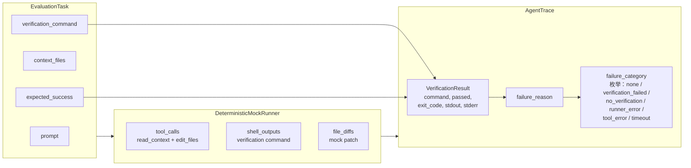
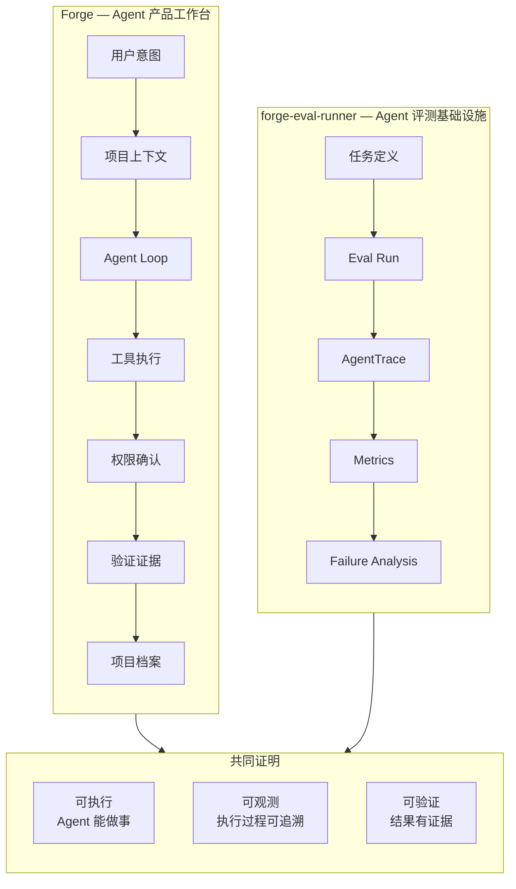
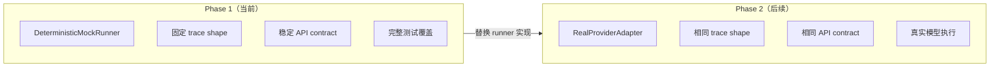

# Architecture

## 系统架构

```mermaid
flowchart TD
    subgraph Input
        T[tasks/sample_tasks.json<br/>EvaluationTask[]]
    end

    subgraph Core
        R[DeterministicMockRunner<br/>生成确定性 trace]
        M[calculate_metrics()<br/>纯函数，无副作用]
        S[InMemoryStorage<br/>进程内存储边界]
    end

    subgraph Output
        AT[AgentTrace<br/>tool_calls, shell_outputs,<br/>file_diffs, verification_result,<br/>failure_category]
        MS[MetricsSummary<br/>success_rate,<br/>verification_coverage,<br/>failure_categories]
    end

    subgraph API["FastAPI Service"]
        H["GET /health"]
        TL["GET /tasks"]
        CR["POST /runs"]
        GR["GET /runs/{id}"]
        GT["GET /runs/{id}/trace"]
        GM["GET /runs/{id}/metrics"]
    end

    subgraph Deliverables
        OD[OpenAPI 自动文档]
        DF[Dockerfile + docker-compose]
        PT[pytest 测试覆盖]
        RF[ruff 代码质量]
    end

    T --> S
    S --> R
    R --> AT
    AT --> M
    M --> MS

    S --> TL
    S --> CR
    S --> GR
    AT --> GT
    MS --> GM

    CR --> R
    R --> S

    API --> OD
    API --> DF
    API --> PT
    API --> RF
```

## Trace 数据流



## Metrics 计算

```mermaid
flowchart TD
    AT[AgentTrace[]] --> CF{trace_passed?}
    CF -->|yes| P[passed = true]
    CF -->|no| F[passed = false<br/>记录 failure_category]

    P --> TM[TaskMetric]
    F --> TM

    TM --> AGG[聚合计算]
    AGG --> SR[success_rate<br/>passed / total]
    AGG --> VC[verification_coverage<br/>有验证的任务 / total]
    AGG --> ATC[average_tool_calls]
    AGG --> FC[failure_categories<br/>各类型计数]
    AGG --> PT[per-task pass/fail]
```

## Forge + forge-eval-runner 关系



## 为什么用 Mock Runner



## 技术栈

| 层 | 选型 | 说明 |
|---|---|---|
| API 框架 | FastAPI | 自动生成 OpenAPI 文档 |
| 数据校验 | Pydantic v2 | ConfigDict(extra="forbid") 严格模式 |
| 包管理 | uv | 快速、确定性依赖解析 |
| 测试 | pytest | test_api / test_runner / test_metrics |
| 代码质量 | ruff | lint + format |
| 容器化 | Dockerfile + docker-compose | 一键启动 |
| Runner | DeterministicMockRunner | 确定性输出，可复现 |
