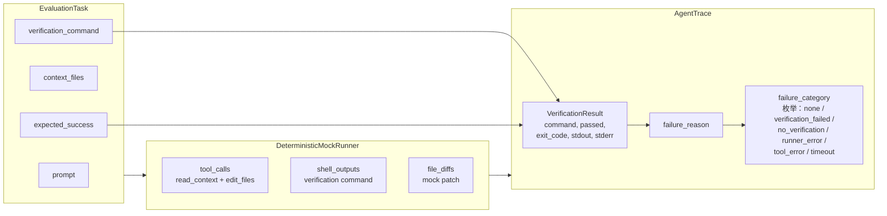
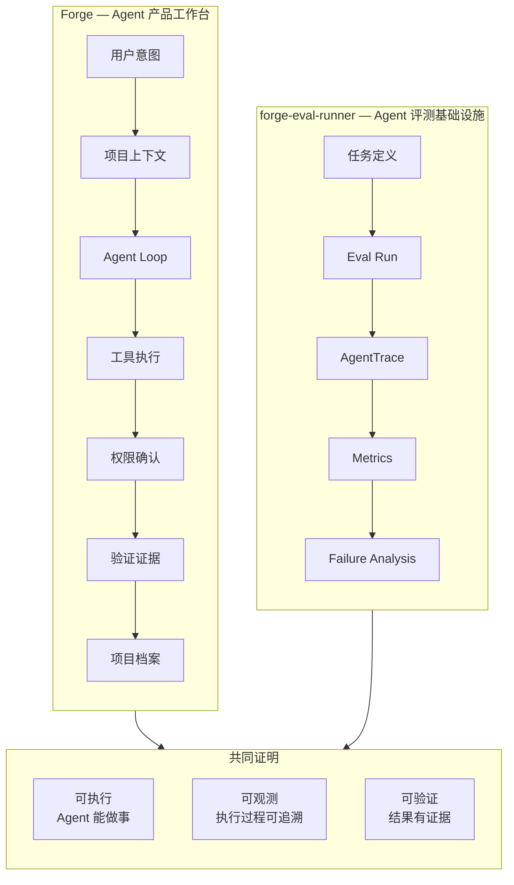
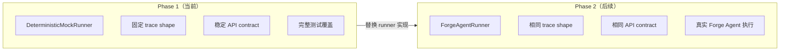
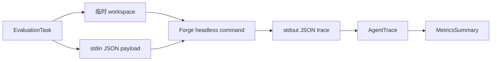

# Architecture

## 系统架构

```mermaid
flowchart TD
    subgraph Input
        T[tasks/sample_tasks.json<br/>EvaluationTask[]]
        EC[eval_cases/*/case.json<br/>fixture + task definitions]
    end

    subgraph Core
        CL[load_cases()<br/>JSON file / directory loader]
        R[RunnerFactory<br/>mock / forge]
        WK[EvalWorker<br/>claim pending run]
        MR[DeterministicMockRunner<br/>生成确定性 trace]
        FR[ForgeAgentRunner<br/>调用外部 Forge headless 命令]
        M[calculate_metrics()<br/>纯函数，无副作用]
        BR[build_report()<br/>回测报告聚合]
        S[EvalStorage<br/>InMemory / SQLite]
        DB[(SQLite<br/>eval_runs / eval_run_tasks /<br/>eval_artifacts / eval_experiments)]
        FS[artifacts/{run_id}<br/>trace.json / report.json]
    end

    subgraph Output
        AT[AgentTrace<br/>tool_calls, shell_outputs,<br/>file_diffs, verification_result,<br/>failure_category]
        MS[MetricsSummary<br/>success_rate,<br/>verification_coverage,<br/>failure_categories]
        RP[BacktestReport<br/>verification_pass_rate,<br/>scope_violation_rate,<br/>per-task trace summary]
    end

    subgraph API["FastAPI Service"]
        H["GET /health"]
        TL["GET /tasks"]
        CR["POST /runs"]
        LR["GET /runs"]
        GR["GET /runs/{id}"]
        GT["GET /runs/{id}/trace"]
        GM["GET /runs/{id}/metrics"]
        GP["GET /runs/{id}/report"]
        GA["GET /runs/{id}/artifacts"]
    end

    subgraph CLI["CLI"]
        BC["python -m app.cli<br/>--cases eval_cases --provider mock"]
        WC["python -m app.worker<br/>--once / polling"]
    end

    subgraph Deliverables
        OD[OpenAPI 自动文档]
        DF[Dockerfile + docker-compose]
        PT[pytest 测试覆盖]
        RF[ruff 代码质量]
    end

    T --> CL
    EC --> CL
    CL --> S
    CL --> BC
    S --> DB
    S --> FS
    S --> R
    S --> WK
    WK --> R
    R --> MR
    R --> FR
    MR --> AT
    FR --> AT
    AT --> M
    AT --> BR
    M --> MS
    BR --> RP

    S --> TL
    S --> CR
    S --> GR
    AT --> GT
    MS --> GM
    RP --> GP

    CR --> R
    R --> S
    BC --> R
    BC --> RP
    WC --> WK

    API --> OD
    API --> DF
    API --> PT
    API --> RF
```

## Trace 数据流



## Metrics 计算

```mermaid
flowchart TD
    AT[AgentTrace[]] --> CF{trace_passed?}
    CF -->|yes| P[passed = true]
    CF -->|no| F[passed = false<br/>记录 failure_category]

    P --> TM[TaskMetric]
    F --> TM

    TM --> AGG[聚合计算]
    AGG --> SR[success_rate<br/>passed / total]
    AGG --> VC[verification_coverage<br/>有验证的任务 / total]
    AGG --> ATC[average_tool_calls]
    AGG --> FC[failure_categories<br/>各类型计数]
    AGG --> PT[per-task pass/fail]
    AT --> RP[BacktestReport<br/>success_rate, verification_pass_rate,<br/>scope_violation_rate,<br/>avg_duration_ms,<br/>avg_model_rounds,<br/>avg_confirm_requests,<br/>failure_categories,<br/>per-task trace summary]
```

## Trust Scorecard

Runs track execution and trust as separate decisions:

- `execution_status` records whether tasks ran to completion, failed, timed out, or were cancelled.
- `trust_status` records whether the harness self-check, dataset fingerprint, scorer calibration, and red-team gates make the score decision-worthy.

Trust gates fail closed. A run with completed task execution can still be untrusted when the harness is untrusted, the dataset has no fingerprint, a model-graded scorer is uncalibrated, or red-team checks fail.

## Sandbox And Leakage Firewall

Trusted evals treat the case workspace as part of the scoring surface, not just a
temporary directory. The sandbox helpers provide four checks:

- `assert_clean_workspace()` rejects unexpected untracked or modified files after
  a case run, with a filesystem fallback for non-git fixtures.
- `scrub_future_repo_state()` removes remotes, non-current branches, tags,
  reflogs, cached origin metadata, and fixture solution notes before an agent can
  inspect future state.
- `detect_future_state_lookup()` flags suspicious commands such as
  `git log --all`, `git reflog`, `git branch -a`, `git remote -v`, and broad
  `git show` lookups.
- `replay_patch()` can apply captured `FileDiff` patches back onto a clean
  workspace to validate that trace diffs are executable.

Golden harness checks run deterministic expected-success cases through the mock
runner. If the harness cannot prove those cases pass, the surrounding trust gate
must fail closed with `harness_untrusted`.

## Dataset And Experiment Snapshots

`dataset_fingerprint()` hashes the stable evaluation surface for a loaded task
set: task ids, prompts, context, fixture path, setup/validation commands,
expected/forbidden file assertions, tags, and metadata. Task order is ignored,
so the same dataset produces the same fingerprint even when cases are loaded in
a different order.

CLI artifacts can include an `experiment` block when `--experiment-name` and
`--output` are provided. That block records the experiment name, dataset
fingerprint, provider, and model beside the report and traces. SQLite also
creates an `eval_experiments` table so durable experiment snapshots can be
attached to stored runs without changing the existing run response contract.

## Forge + forge-eval-runner 关系



## 为什么用 Mock Runner



## Forge Runner 接入协议

`provider=forge` 时，API 会使用 `FORGE_EVAL_FORGE_AGENT_COMMAND` 指定的外部命令。

本地真实 Forge 接入命令：

```bash
FORGE_EVAL_FORGE_AGENT_COMMAND="cargo run --manifest-path ../desktop/src-tauri/Cargo.toml --bin forge_eval_agent --quiet" \
  uv run python -m app.cli --cases eval_cases/small-edit-success --provider forge --model local-forge
```

Forge headless command 从 stdin 读取 task/prompt/workspace JSON，从 stdout 输出单个 trace JSON。进程 exit code 只表示 headless runner 是否崩溃；任务成功、验证失败、scope violation、模型/API 错误都应通过 trace 字段表达。



外部命令输出的 `changed_files` 会和任务里的 `expected_files_changed` / `forbidden_files_changed` 做 scope check。即使验证命令通过，只要改动越界，也会计入 `scope_violation`。

## V0.2 Persistence

V0.2 adds a storage abstraction that keeps the current synchronous API behavior while allowing run state to survive process restarts.

```mermaid
flowchart TD
    API["POST /runs"] --> R[RunnerFactory]
    R --> TR[AgentTrace[]]
    TR --> MS[MetricsSummary]
    TR --> RP[BacktestReport]
    MS --> DB[(SQLite eval_runs)]
    TR --> TF[artifacts/{run_id}/trace.json]
    RP --> RF[artifacts/{run_id}/report.json]
    TF --> AM[(SQLite eval_artifacts)]
    RF --> AM
    TR --> TS[(SQLite eval_run_tasks<br/>summary only)]
```

The database stores metadata and summaries only. Large trace/report JSON remains in filesystem artifacts so SQLite rows stay small and easy to inspect. The API can list persisted runs through `GET /runs` and expose trace/report artifact metadata through `GET /runs/{id}/artifacts`.

Local SQLite mode:

```bash
FORGE_EVAL_STORAGE_BACKEND=sqlite \
FORGE_EVAL_DB_PATH=./forge_eval.db \
FORGE_EVAL_ARTIFACTS_PATH=./artifacts \
uv run uvicorn app.main:app --reload --port 8000
```

## V0.3 Worker

V0.3 keeps synchronous API execution as the default, then adds a queued mode for team-service behavior.

```mermaid
flowchart TD
    CR["POST /runs<br/>queued mode"] --> PR[(eval_runs<br/>status=pending)]
    WK["python -m app.worker"] --> CLM[claim_pending_run()]
    CLM --> RR[(eval_runs<br/>status=running)]
    RR --> EX[RunnerFactory<br/>mock / forge]
    EX --> TR[AgentTrace]
    TR --> TS[(eval_run_tasks)]
    TR --> TF[trace.json]
    TR --> RF[report.json]
    TF --> AR[(eval_artifacts)]
    RF --> AR
    TS --> DONE[(eval_runs<br/>status=completed)]
```

Queued API mode:

```bash
FORGE_EVAL_STORAGE_BACKEND=sqlite \
FORGE_EVAL_RUN_EXECUTION_MODE=queued \
FORGE_EVAL_DB_PATH=./forge_eval.db \
FORGE_EVAL_ARTIFACTS_PATH=./artifacts \
uv run uvicorn app.main:app --reload --port 8000
```

Worker:

```bash
FORGE_EVAL_STORAGE_BACKEND=sqlite \
FORGE_EVAL_DB_PATH=./forge_eval.db \
FORGE_EVAL_ARTIFACTS_PATH=./artifacts \
uv run python -m app.worker --once
```

## 三种运行方式

| 模式 | 命令 | 特点 | 依赖 |
|---|---|---|---|
| a. Mock 离线回测 | `uv run python -m app.cli --cases eval_cases --provider mock` | 确定性、无 API key、最快 | 仅 Python/uv |
| b. Forge headless 本地真实回测 | `npm run eval:forge:smoke` | 真实 Agent 执行、完整 trace | Rust + API key |
| c. Queued worker + SQLite 服务 | `uv run uvicorn app.main:app` + `uv run python -m app.worker` | 持久化、队列、团队共享 | SQLite + worker |

### 环境变量

| Variable | 适用场景 | 说明 |
|---|---|---|
| `FORGE_EVAL_FORGE_AGENT_COMMAND` | `provider=forge` | 启动 Forge headless agent 的命令。默认从 `apps/desktop/` 解析为 `cargo run --manifest-path ../desktop/src-tauri/Cargo.toml --bin forge_eval_agent --quiet`。 |
| `FORGE_HEADLESS_PROVIDER` | `provider=forge` | LLM provider，如 `anthropic`、`openai`、`deepseek`。默认 `deepseek`。 |
| `FORGE_HEADLESS_MODEL` | `provider=forge` | 模型 ID。默认 `deepseek-v4-flash`。 |
| `ANTHROPIC_API_KEY` / `OPENAI_API_KEY` / `DEEPSEEK_API_KEY` | `provider=forge` | 对应 provider 的 API key，Forge 从 `~/.forge/config.json` 读取。 |
| `FORGE_EVAL_RUNNER_PATH` | 可选 | 覆盖 eval-runner 目录。默认与 `apps/desktop/` 同级的 `eval-runner`。 |

## 技术栈

| 层 | 选型 | 说明 |
|---|---|---|
| API 框架 | FastAPI | 自动生成 OpenAPI 文档 |
| 数据校验 | Pydantic v2 | ConfigDict(extra="forbid") 严格模式 |
| 包管理 | uv | 快速、确定性依赖解析 |
| 测试 | pytest | test_api / test_runner / test_metrics |
| 代码质量 | ruff | lint + format |
| 容器化 | Dockerfile + docker-compose | 一键启动 |
| Runner | DeterministicMockRunner | 确定性输出，可复现 |
| Case Loader | `app.cases.load_cases()` | 从 JSON 文件或目录批量加载 eval case |
| CLI | `python -m app.cli` | 离线 mock 回测和 JSON report 输出 |
| Persistence | `sqlite3` 标准库 | 本地 durable run/task/artifact metadata |
