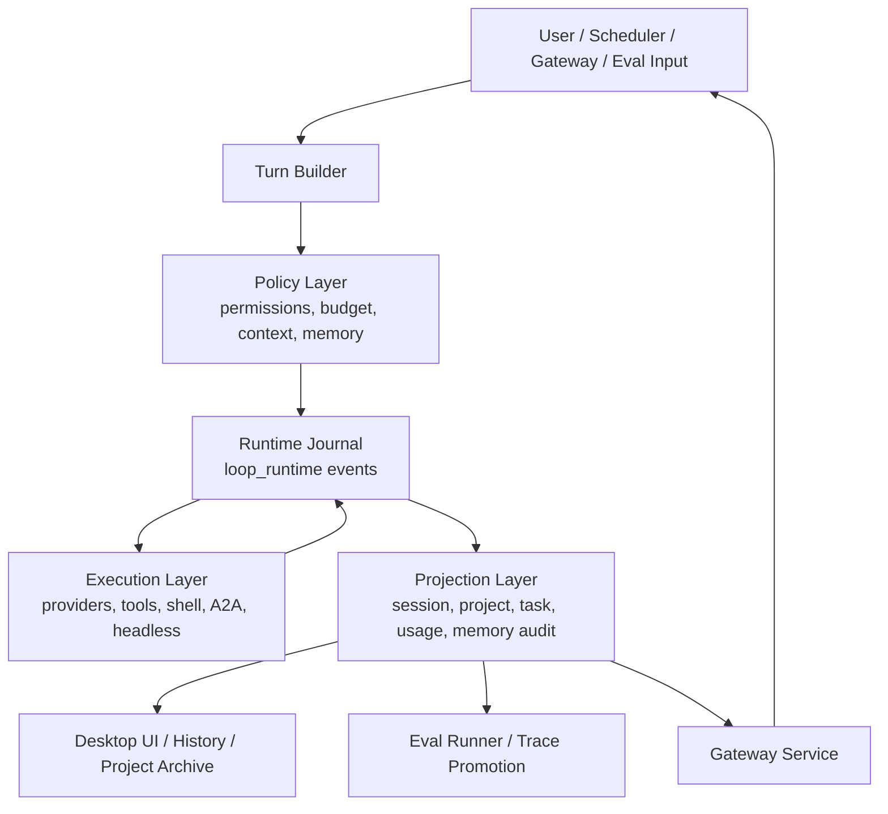

# Forge Backend Long-Chain Roadmap Implementation Plan

> **For agentic workers:** REQUIRED SUB-SKILL: Use superpowers:subagent-driven-development (recommended) or superpowers:executing-plans to implement this plan task-by-task. Steps use checkbox (`- [ ]`) syntax for tracking.

**Goal:** Turn Forge's backend into one durable, observable local agent runtime that can safely support desktop self-use, headless/eval runs, scheduled/background work, and eventually gateway-owned execution.

**Architecture:** Keep `apps/desktop` as the runtime authority until the local contracts are boringly stable. Consolidate around an event-sourced runtime spine: user input produces a turn/run record, policy/context/memory decisions become typed ledger events, tools/providers/A2A/headless work emit replayable events, projections feed UI/status/eval, and gateway becomes a transport/ownership layer only after parity tests pass.

**Tech Stack:** Rust/Tauri backend, React/TypeScript protocol mirrors, SQLite/JSON local stores, `loop_runtime` event journal/projections, gateway service, eval-runner Python trace contracts, Playwright e2e, Cargo/Node acceptance gates, GitNexus impact analysis.

---

## Current Backend Assessment

Forge backend is already broad, but the authority boundaries are still too scattered.

**Strong areas:**

- `apps/desktop/src-tauri/src/protocol/events.rs` is already the main backend-to-frontend stream contract.
- `loop_runtime` has the right building blocks: journal, projection, policy, budget, human gates, completion, and headless ownership records.
- Session persistence, transcript replay, confirmation replay, watchdogs, diagnostics, permission modes, A2A lineage, provider usage, and acceptance gates already exist.
- `apps/eval-runner` has a useful external trace contract and can become the regression lens for real Forge runs.
- Memory Phase 1 now has a unified read/recall model across wiki memory, memory facts, and continuity experiences.

**Main weakness:**

- The product has multiple partial sources of truth: `AppState.sessions`, transcript events, snapshots, `loop_runtime` projections, gateway run records, scheduler state, permission state, memory stores, and eval traces.
- Gateway exists, but it should not yet own the core loop because memory, context accounting, permission decisions, and restart recovery still need tighter local contracts.
- Context/token accounting and memory/continuity injection are still too easy to double-count or explain poorly.
- GitNexus is useful, but current workflows need timeout/fallback handling so backend development does not stall on code-intelligence tooling.

**Long-chain diagnosis:** Forge is past prototype breadth. The next backend phase is not "add more surfaces"; it is "make every surface read from the same durable runtime facts."

---

## Target Backend Shape



The backend should converge to six contracts:

1. **Turn Contract:** one `PreparedTurn` describes visible input, hidden context, selected memory, selected files, MCP context, workflow, and budget estimate before provider dispatch.
2. **Policy Contract:** one decision record explains why a tool, shell, memory, context, or confirmation path was allowed, blocked, auto-approved, or manually gated.
3. **Runtime Event Contract:** every meaningful state transition is replayable from `loop_runtime` journal plus transcript events.
4. **Projection Contract:** UI, History, Project Archive, Diagnostics, gateway status, and eval traces read from typed projections instead of recomputing their own truth.
5. **Evidence Contract:** every completed turn/run can produce a compact trace with prompt, context sources, memory audit, tool calls, files changed, verification, usage, and failure category.
6. **Gateway Parity Contract:** gateway and local execution emit equivalent events/projections before gateway becomes default owner.

---

## Long-Chain Phases

### Phase 0: Backend Contract Inventory And State Map

**Purpose:** Create one map of backend facts before consolidating code. This phase prevents accidental rewrites and makes each later phase measurable.

**Status (2026-07-01):** DONE - backend authority map created with 15 mapped domains in `docs/desktop/backend-state-authority-map.md`; no code consolidation started.

**Files:**

- Create: `docs/desktop/backend-state-authority-map.md`
- Modify: `docs/superpowers/plans/2026-07-01-forge-backend-long-chain-roadmap.md`
- Inspect: `apps/desktop/src-tauri/src/state.rs`
- Inspect: `apps/desktop/src-tauri/src/protocol/events.rs`
- Inspect: `apps/desktop/src-tauri/src/loop_runtime/types.rs`
- Inspect: `apps/desktop/src-tauri/src/ipc/send_input_context.rs`
- Inspect: `apps/desktop/src-tauri/src/gateway/protocol.rs`
- Inspect: `apps/desktop/src-tauri/src/eval_headless/trace.rs`

- [x] **Step 1: Document every backend state owner**

Create `docs/desktop/backend-state-authority-map.md` with this structure:

```markdown
# Forge Backend State Authority Map

| Domain | Current Owner | Durable Store | Projection Consumer | Known Drift |
|---|---|---|---|---|
| Live sessions | `AppState.sessions` | snapshot + transcript | SessionView, History | live status can differ from replayed transcript |
| Pending confirmations | `Harness.pending_confirms` + transcript | snapshot descriptor + `confirm_response` | ConfirmCard, ProjectStatusCard | auto-decision reason not fully ledgered |
| Memory recall | unified memory IPC + source stores | wiki JSON, memory JSON, continuity DB | Project Archive, send-input | actions still source-specific |
| Context usage | `ContextBuilder` + provider usage events | turn state + transcript | Composer, usage traces | pre-run estimate and post-run usage not one contract |
| Loop tasks | `loop_runtime` journal/projection | loop runtime store | project runtime/status/gateway | not yet the only task truth |
| Gateway trigger runs | gateway runner/store | trigger run JSON | gateway dashboard/status | gateway not equivalent to local loop |
| Eval traces | eval-headless/eval-runner | trace artifacts | eval runner reports | not fully promoted from all desktop turns |
```

- [x] **Step 2: Verify the map against code**

Run:

```bash
python3 -c 'import subprocess, sys; subprocess.run(["node", ".gitnexus/run.cjs", "query", "session runtime memory context gateway eval trace", "-r", "forge", "-l", "10"], check=True, timeout=60)'
```

Expected: command returns related processes. If it times out, record `GitNexus unavailable; fallback used: rg/find over src-tauri modules` in the map.

- [x] **Step 3: Add map coverage to the roadmap**

Update this roadmap's Phase 0 status line with the date and the number of mapped domains. Do not start code consolidation until the map exists.

**验收点:**

- Every backend surface mentioned in `scripts/acceptance.sh` has a state owner listed.
- The map names at least one drift risk per critical domain.
- No production code changes in this phase.

### Phase 1: Unified Turn Preparation Contract

**Purpose:** Make `send_input` produce one backend-owned pre-dispatch contract for context, memory, files, permissions, workflow, and token estimate.

**Status (2026-07-01):** DONE - additive `PreparedTurn` / `ContextUsageEstimate` contract and `turn_prepared` stream event shipped. Composer now uses backend pre-dispatch estimates as `local_estimate`, provider usage remains post-run truth, hidden context bodies are not serialized, and store regressions cover unknown provider usage plus compaction metadata reset.

**Files:**

- Create: `apps/desktop/src-tauri/src/agent/prepared_turn.rs`
- Modify: `apps/desktop/src-tauri/src/ipc/send_input_context.rs`
- Modify: `apps/desktop/src-tauri/src/agent/context_builder.rs`
- Modify: `apps/desktop/src-tauri/src/agent/turn_state.rs`
- Modify: `apps/desktop/src-tauri/src/protocol/events.rs`
- Modify: `apps/desktop/src/lib/protocol.ts`
- Test: `apps/desktop/src-tauri/src/ipc/send_input_context_tests.rs`
- Test: `apps/desktop/e2e/composer.spec.ts`

- [x] **Step 1: Add `PreparedTurn` tests before implementation**

Add tests that assert a prepared turn includes:

- visible user input;
- hidden context parts with source ids;
- selected unified memories exactly once;
- project records exactly once;
- estimated token count by source;
- workflow and slash command classification;
- permission mode snapshot.

Run:

```bash
cargo test --manifest-path apps/desktop/src-tauri/Cargo.toml send_input_prepared_turn --lib
```

Expected before implementation: FAIL because `PreparedTurn` does not exist.

- [x] **Step 2: Implement `PreparedTurn` as an additive type**

`PreparedTurn` should be a pure data structure first. It should not dispatch providers, mutate files, or emit UI events.

Required fields:

```rust
pub(crate) struct PreparedTurn {
    pub(crate) session_id: String,
    pub(crate) project_path: String,
    pub(crate) user_text: String,
    pub(crate) activation_text: String,
    pub(crate) hidden_contexts: Vec<HiddenContextPart>,
    pub(crate) selected_memory_ids: Vec<String>,
    pub(crate) context_estimate: ContextUsageEstimate,
    pub(crate) workflow: WorkflowState,
    pub(crate) permission_mode: String,
    pub(crate) turn_metadata: AgentTurnMetadata,
}
```

- [x] **Step 3: Emit a typed pre-dispatch event**

Add a `StreamEvent::TurnPrepared` variant and TypeScript mirror. The event must omit hidden context bodies but include source labels, estimated tokens, selected memory ids, and permission mode.

- [x] **Step 4: Switch composer context number to backend estimate**

Update the frontend composer to display backend `TurnPrepared.context_estimate` when present. Keep provider usage as post-run truth.

**验收点:**

- Composer no longer computes a conflicting context number for a live turn.
- Memory and continuity context are not counted twice.
- `provider_usage` still replaces/reconciles post-run usage without duplicate legacy usage.
- Existing `send_input` tests and `composer.spec.ts` pass.

### Phase 2: Unified Memory Actions And Recall Audit

**Purpose:** Finish the memory merge at the API/action layer without physically migrating stores yet.

**Files:**

- Modify: `apps/desktop/src-tauri/src/memory/unified.rs`
- Modify: `apps/desktop/src-tauri/src/ipc/unified_memory.rs`
- Modify: `apps/desktop/src-tauri/src/ipc/send_input_context.rs`
- Modify: `apps/desktop/src/components/context/UnifiedMemorySection.tsx`
- Test: `apps/desktop/src-tauri/src/ipc/unified_memory.rs`
- Test: `apps/desktop/e2e/acceptance.spec.ts`

- [x] **Step 1: Add failing action-routing tests**

Add tests for:

- archive wiki memory by `wiki_memory:<id>`;
- forget memory fact by `memory_fact:<id>`;
- archive continuity experience by `continuity_experience:<id>`;
- reject unknown source;
- reject source id not found.

- [x] **Step 2: Implement source adapters**

Add `UnifiedMemoryAction` and route to existing store-specific methods. Do not copy store internals into IPC handlers.

- [x] **Step 3: Add recall audit output**

Every selected memory should expose:

- source;
- source id;
- kind;
- score;
- reason;
- project/profile match;
- injection status.

- [x] **Step 4: Add Project Archive action smoke**

Add a Playwright test that archives one unified memory row and verifies it disappears from the default accepted list while remaining available under archived filter.

**验收点:**

- Project Archive is the user-facing read/status surface for all memory sources.
- Settings remains the detailed profile fact editor until unified edit UX exists.
- Send-input recall audit is available for debugging without exposing hidden context bodies in normal UI.

**Status (2026-07-01):** DONE - `apply_unified_memory_action` routes archive/forget to the existing wiki, memory fact, and continuity stores; Project Archive can switch between current and archived unified rows; send-input `turn_prepared` includes selected memory audit metadata while preserving hidden memory bodies out of the event JSON.

### Phase 3: Permission And Confirmation Ledger

**Purpose:** Make permission/full-access/trust/confirmation behavior backend-authoritative and replayable.

**Files:**

- Create: `apps/desktop/src-tauri/src/harness/permission_ledger.rs`
- Modify: `apps/desktop/src-tauri/src/harness/permissions.rs`
- Modify: `apps/desktop/src-tauri/src/ipc/permission_handlers.rs`
- Modify: `apps/desktop/src-tauri/src/ipc/confirmations.rs`
- Modify: `apps/desktop/src-tauri/src/protocol/events.rs`
- Modify: `apps/desktop/src/lib/protocol.ts`
- Test: `apps/desktop/src-tauri/src/harness/permissions_test.rs`
- Test: `apps/desktop/e2e/acceptance.spec.ts`

- [x] **Step 1: Add ledger event tests**

Cover these event kinds:

- `mode_changed`;
- `manual_required`;
- `auto_approved`;
- `blocked_external_path`;
- `blocked_sensitive_path`;
- `user_approved`;
- `user_declined`.

- [x] **Step 2: Persist policy source for every decision**

Each event must include workspace path, session id when present, risk tier, affected files, operation, permission mode, and reason.

- [x] **Step 3: Make confirmation cards derive from ledger/protocol state**

The UI may render pending cards, but it must not infer auto-approval from button state. It should display backend decision evidence.

- [x] **Step 4: Extend acceptance gates**

Add or keep gates for:

```bash
cargo test --manifest-path apps/desktop/src-tauri/Cargo.toml permission_handlers --lib
cargo test --manifest-path apps/desktop/src-tauri/Cargo.toml harness::permissions --lib
npm --prefix apps/desktop run test:e2e -- e2e/acceptance.spec.ts -g "permission|confirmation|full access|trust"
```

**验收点:**

- New sessions restore the intended workspace permission mode.
- Confirmation cards appear only when backend says manual approval is required.
- Auto-approved steps are visible in transcript/history as replayable backend evidence.
- External and sensitive boundaries remain manual or blocked according to policy.

**Status (2026-07-01):** DONE - Permission decisions now emit backend ledger evidence for mode changes, manual gates, automatic approvals, external/sensitive/policy blocks, and user approve/decline responses. Confirmation descriptors and response events carry that evidence through transcript replay, tool cards merge auto-approval/block evidence without standalone noise blocks, the in-memory ledger is capped/pruned, and the acceptance matrix advertises the focused `permission|confirmation|full access|trust` smoke gate.

### Phase 4: Runtime Journal As Task Authority

**Purpose:** Make `loop_runtime` projections the common task/run source for UI, gateway status, background tasks, History, and eval.

**Files:**

- Modify: `apps/desktop/src-tauri/src/loop_runtime/types.rs`
- Modify: `apps/desktop/src-tauri/src/loop_runtime/mod.rs`
- Modify: `apps/desktop/src-tauri/src/loop_runtime/projection.rs`
- Modify: `apps/desktop/src-tauri/src/loop_runtime/runner.rs`
- Modify: `apps/desktop/src-tauri/src/bin/forge_trigger.rs`
- Modify: `apps/desktop/src-tauri/src/gateway/server.rs`
- Modify: `apps/desktop/src-tauri/src/gateway/protocol.rs`
- Modify: `apps/desktop/src-tauri/src/gateway/dashboard.rs`
- Modify: `apps/desktop/src-tauri/src/ipc/diagnostics_handlers.rs`
- Modify: `apps/desktop/src-tauri/src/eval_headless/trace.rs`
- Modify: `apps/desktop/src-tauri/src/eval_headless/types.rs`
- Modify: `apps/desktop/src/lib/protocol.ts`
- Modify: `apps/desktop/src/lib/ipc/types.ts`
- Modify: `apps/desktop/src/lib/loopRuntime.ts`
- Modify: `apps/desktop/src/components/settings/diagnosticsRuntimeView.ts`
- Modify: `scripts/acceptance.sh`
- Modify: `README.md`
- Modify: `apps/desktop/README.md`
- Modify: `CHANGELOG.md`
- Test: `apps/desktop/src-tauri/src/loop_runtime/replay_tests.rs`
- Test: `apps/desktop/src-tauri/src/gateway/server.rs`
- Test: `apps/desktop/src-tauri/src/eval_headless/mod.rs`
- Test: `apps/desktop/src/lib/loopRuntime.test.ts`
- Test: `apps/desktop/src/lib/backgroundTaskStatus.test.ts`
- Test: `apps/desktop/src/components/settings/diagnosticsRuntimeView.test.ts`
- Test: `scripts/acceptance.test.mjs`

- [x] **Step 1: Add projection parity tests**

For the same synthetic run, assert that:

- project runtime status;
- gateway runtime status;
- background task card state;
- eval trace summary;

all read the same task id, owner, status, completion evidence, failure category, and usage summary.

- [x] **Step 2: Add orphan/interrupted states**

Represent `orphaned`, `interrupted`, and `recoverable` explicitly in `LoopTaskStatus` or typed projection fields. Avoid encoding them only as strings in UI copy.

- [x] **Step 3: Add one recovery action**

Implement a backend recovery command for a stale/orphaned run:

- mark interrupted;
- attach recovery notice;
- leave trace/evidence readable.

- [x] **Step 4: Update acceptance matrix**

Add targeted gates if missing:

```bash
cargo test --manifest-path apps/desktop/src-tauri/Cargo.toml loop_runtime::journal --lib
cargo test --manifest-path apps/desktop/src-tauri/Cargo.toml loop_runtime::replay_tests --lib
cargo test --manifest-path apps/desktop/src-tauri/Cargo.toml dispatch_runtime_status_returns_queue_and_run_summary --lib
cargo test --manifest-path apps/desktop/src-tauri/Cargo.toml recover_loop_task_marks_running_task_interrupted_and_recoverable --lib
cargo test --manifest-path apps/desktop/src-tauri/Cargo.toml trace_payload_includes_projected_loop_task_authority --lib
node --test apps/desktop/src/lib/loopRuntime.test.ts apps/desktop/src/components/settings/diagnosticsRuntimeView.test.ts
```

**验收点:**

- One run id can be traced from input through runtime journal, UI projection, gateway status, and eval trace.
- Restart replay can distinguish completed, interrupted, orphaned, and recoverable runs.
- No UI surface invents task status from local-only state.

**Status (2026-07-01):** DONE - `LoopTaskRecord` projection now carries backend-owned `latest_usage_ledger` and typed `recovery_state` fields, including explicit orphaned/interrupted/recoverable recovery metadata replayed from journal events. Gateway runtime status, dashboard metrics, CLI/status summaries, diagnostics, background loop summaries, and eval trace payloads read those projection fields instead of deriving their own task truth. A new `recover_loop_task` gateway command marks stale/orphaned nonterminal tasks interrupted through the journal, rebuilds projection state, and returns a durable recovery notice while leaving prior usage/evidence readable. The acceptance matrix advertises a focused runtime journal authority/recovery smoke gate.

### Phase 5: Evidence And Eval Promotion Loop

**Purpose:** Make every meaningful Forge run promotable into eval evidence without manual reconstruction.

**Files:**

- Modify: `apps/desktop/src-tauri/src/eval_headless/trace.rs`
- Modify: `apps/desktop/src-tauri/src/bin/forge_session.rs`
- Modify: `apps/desktop/src-tauri/src/lib.rs`
- Modify: `apps/eval-runner/app/trace_import.py`
- Modify: `apps/eval-runner/app/models.py`
- Modify: `apps/eval-runner/app/runner.py`
- Modify: `apps/eval-runner/app/scoring.py`
- Modify: `scripts/acceptance.sh`
- Test: `apps/desktop/src-tauri/src/bin/forge_session.rs`
- Test: `apps/desktop/src-tauri/src/eval_headless/mod.rs`
- Test: `apps/eval-runner/tests/test_cases.py`
- Test: `apps/eval-runner/tests/test_metrics.py`
- Test: `apps/eval-runner/tests/test_runner.py`
- Test: `scripts/acceptance.test.mjs`

- [x] **Step 1: Define `ForgeRunEvidence` fields**

Evidence must include:

- prompt and normalized goal;
- prepared turn context summary;
- memory audit summary;
- permission decisions;
- tool calls and shell results;
- changed files/diffs;
- verification command/result;
- provider usage/cost;
- completion/failure category;
- continuity lessons formed.

- [x] **Step 2: Export one desktop run as eval input**

Add a CLI or IPC path that exports a selected session/run into eval-runner trace import format.

- [x] **Step 3: Score runtime reliability**

Add scorers for:

- confirmation correctness;
- context duplication;
- verification present;
- changed-file scope;
- recovery evidence;
- usage accounting consistency.

**验收点:**

- A real desktop run can be imported into eval-runner without hand-editing JSON.
- Eval report can explain failure category using Forge backend evidence.
- `npm run test:eval` remains independently runnable.

**Status (2026-07-01):** DONE - `AgentTrace` now accepts optional `ForgeRunEvidence`, `trace_import.load_traces()` normalizes direct desktop trace payloads and `{ "traces": [...] }` artifacts without requiring hand-edited JSON, and `forge_session export-eval <session_id>` exports latest session snapshot/transcript facts as eval-runner-readable evidence. Desktop headless traces now emit `forge_run_evidence` with prompt, normalized goal, prepared context, memory audit, permission decisions, tool/shell facts, changed files, verification, provider usage, failure/recovery, and continuity diagnostics. Eval scoring adds Forge runtime reliability scores for confirmation correctness, context duplication, verification presence, changed-file scope, recovery evidence, and usage consistency only when Forge evidence is present. Acceptance advertises a focused desktop eval promotion evidence smoke gate.

### Phase 6: Gateway Parity Gate, Then Ownership

**Purpose:** Move gateway last, after local backend facts are stable.

**Files:**

- Modify: `apps/desktop/src-tauri/src/gateway/protocol.rs`
- Modify: `apps/desktop/src-tauri/src/gateway/server.rs`
- Modify: `apps/desktop/src-tauri/src/gateway/runner.rs`
- Modify: `apps/desktop/src-tauri/src/ipc/session_input_inbox.rs`
- Modify: `apps/desktop/src-tauri/src/diagnostics/watchdog.rs`
- Test: `apps/desktop/src-tauri/src/gateway/server.rs`
- Test: `apps/desktop/e2e/level3-runtime-restart.spec.ts`

- [ ] **Step 1: Build local-vs-gateway fixture parity tests**

For the same scripted prompt, assert gateway and local path emit equivalent:

- turn prepared summary;
- policy decisions;
- memory audit;
- transcript events;
- usage;
- runtime projection;
- completion evidence.

- [ ] **Step 2: Add gateway capability flag**

Default remains local. Gateway ownership is opt-in until parity and recovery gates pass.

- [ ] **Step 3: Add degraded-mode behavior**

Gateway failure must produce a visible status and fall back to local path when safe. It must not silently lose input or strand pending confirmations.

**验收点:**

- Gateway can be disabled without data migration.
- Gateway failures are visible and actionable.
- Gateway becomes default only when parity tests and restart/recovery gates are green.

### Phase 7: Backend Operating Model

**Purpose:** Make backend work repeatable: impact analysis, evidence, acceptance, docs, and release confidence.

**Files:**

- Modify: `AGENTS.md`
- Modify: `apps/desktop/AGENTS.md`
- Create: `scripts/gitnexus-safe.mjs`
- Modify: `scripts/acceptance.sh`
- Modify: `README.md`
- Modify: `apps/desktop/README.md`
- Modify: `CHANGELOG.md`
- Test: `scripts/gitnexus-safe.test.mjs`
- Test: `scripts/acceptance.test.mjs`

- [x] **Step 1: Add GitNexus timeout wrapper**

The wrapper should run GitNexus commands with a 60 second timeout and print fallback instructions.

- [x] **Step 2: Add fallback impact report template**

When GitNexus is unavailable, workers must record:

- command attempted;
- timeout/error;
- index freshness;
- symbols searched;
- files inspected;
- direct callers found;
- tests selected;
- affected authority domains;
- residual risk.

- [x] **Step 3: Keep acceptance matrix grouped**

Group acceptance gates by backend domain: runtime, permission, usage/context, memory, gateway, eval, UI evidence.

**验收点:**

- A stuck code-intelligence command cannot block development indefinitely.
- Every backend PR names the affected authority domains and verification gates.
- Acceptance dry-run remains the single source for advertised runtime checks.

**Status (2026-07-01):** DONE - `scripts/gitnexus-safe.mjs` wraps local GitNexus CLI/index commands with a default 60 second timeout, exits timed-out commands with 124, and prints the fallback impact report template plus index refresh hint. `AGENTS.md` and `apps/desktop/AGENTS.md` now require fallback impact reports when GitNexus MCP/CLI is unavailable, stale, or timed out. The acceptance matrix carries backend authority domain metadata in `--list-json`, help remains generated from the same matrix, dry-run order/text stays the executable source of truth, and the matrix includes a focused GitNexus wrapper contract gate plus a lightweight memory recall/archive coverage status gate.

---

## Recommended Execution Order

1. **Phase 0:** State authority map.
2. **Phase 1:** Unified turn preparation and context estimate.
3. **Phase 2:** Unified memory actions and recall audit.
4. **Phase 3:** Permission/confirmation ledger.
5. **Phase 4:** Runtime journal as task authority.
6. **Phase 5:** Evidence/eval promotion.
7. **Phase 7:** Backend operating model hardening.
8. **Phase 6:** Gateway parity and opt-in ownership.

This order is deliberate: context and permissions must be trustworthy before runtime projections become authoritative; runtime projections must be trustworthy before eval promotion; the backend operating model must keep evidence and impact analysis repeatable before gateway ownership becomes default.

## Milestone Gates

### M1: Local Turn Truth

- `PreparedTurn` exists.
- Composer uses backend context estimate.
- Memory recall audit exists.
- Permission mode snapshot is included.

### M2: Replayable Safety

- Permission decisions are ledgered.
- Confirmation decisions are replayable.
- External/sensitive boundaries are covered by automated tests.

### M3: Runtime Authority

- `loop_runtime` projection is the task/run source for UI and gateway status.
- Orphan/interrupted/recoverable states are typed.
- Restart evidence distinguishes all terminal and recoverable states.

### M4: Evidence Loop

- Real Forge runs export into eval-runner.
- Eval scorers cover context, memory, permission, verification, and recovery quality.

### M5: Gateway Default-Ready

- Gateway/local parity tests pass.
- Gateway fallback is explicit.
- Gateway ownership can be enabled/disabled by capability flag.

---

## Risk Register

| Risk | Why It Matters | Mitigation |
|---|---|---|
| `AgentSession` and `send_input` blast radius | They sit on the hot path for every turn | Add `PreparedTurn` alongside current path first; cut over after focused tests |
| Gateway too early | Gateway can amplify state drift | Keep opt-in until parity tests pass |
| Context estimate mismatch | User sees wrong model/context numbers | Backend emits pre-run estimate; provider usage reconciles post-run |
| Permission UI optimism | Trust/full-access can look stronger than backend policy | Ledger decisions and derive UI from backend evidence |
| Memory over-merge | Physical migration could lose source semantics | Merge actions/audit first; migrate storage only after evidence |
| GitNexus hangs/stale index | Blocks backend iteration | Timeout wrapper plus documented fallback report |

---

## Definition Of Done For Each Phase

- GitNexus impact analysis is run before editing production symbols; HIGH/CRITICAL risk is reported before proceeding.
- Focused Rust/TS tests for the touched backend domain pass.
- Product-level Playwright smoke covers changed user-visible runtime behavior.
- `scripts/acceptance.sh --dry-run` advertises the relevant gate.
- User-visible runtime changes update `README.md`, `apps/desktop/README.md`, and `CHANGELOG.md`.
- `detect_changes -s staged -r forge` runs before commit; if GitNexus is unavailable, a fallback impact report is committed or linked.

## First Implementation Slice Recommendation

Start with **Phase 0 + Phase 1** as one short branch:

- Phase 0 is documentation-only and gives us a map.
- Phase 1 fixes the most visible backend confusion: context/token accounting, hidden context explainability, and one pre-dispatch turn contract.
- Phase 2 memory action unification can follow immediately because Phase 1 gives memory recall a stable audit slot.

Do **not** start with gateway ownership. Gateway should be the final convergence layer, not the place where current state ambiguity gets hidden.
