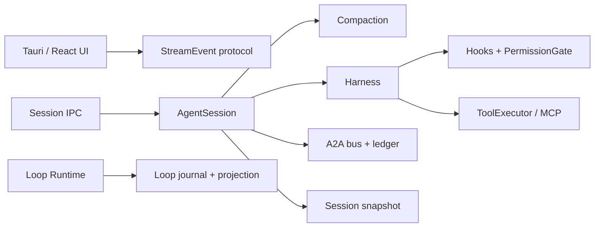
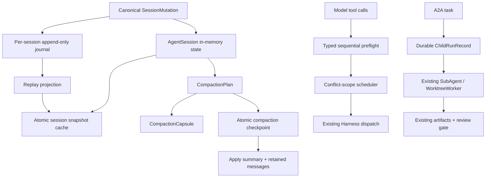

# Forge Selective Grok Runtime Adoption Design

> Date: 2026-07-20
> Status: Approved direction; implementation is split into four independently gated plans
> Source comparison: local Forge worktree plus `xai-org/grok-build` commit `ba76b0a683fa52e4e60685017b85905451be17bc`

## 1. Decision

Forge will selectively adopt four runtime patterns demonstrated by Grok Build:

1. crash-safe session persistence with an append-only canonical mutation journal;
2. state-aware compaction with a persisted checkpoint and a structured continuity capsule;
3. typed tool preflight followed by conflict-aware execution;
4. resumable subagent identity and durable child-run records.

Forge will not adopt Grok Build's per-session OS thread, eight-megabyte session stack, giant session actor, public-mirror worktree pool, or long default sampler retry budget. Forge keeps its current `AgentSession`, Tauri event protocol, A2A review gate, worktree lease, and Loop Runtime authority boundaries.

The implementation is deliberately evolutionary. Existing snapshots remain the restore authority until a shadow journal proves replay parity. Existing compaction remains available until checkpoint recovery and capsule injection pass acceptance. Existing write serialization remains the fallback until conflict scopes are proven safe. Existing ephemeral subagents remain the execution engine until durable records can resume without fabricating live processes.

## 2. Why selective convergence is the recommended approach

Three approaches were evaluated.

### Approach A — transplant Grok's session actor hierarchy

This would place every Forge session and subagent on a dedicated OS thread and move chat state, sampling, and dispatch behind actor handles.

Benefits:

- strong state ownership;
- fewer cross-thread mutex interactions;
- one command protocol for prompt, cancel, compact, model switch, and background events.

Rejected because:

- `AgentSession` already feeds Tauri IPC, snapshots, goal state, A2A, eval-headless, and gateway surfaces;
- a topology rewrite would combine runtime migration with product migration;
- per-session thread stacks are a poor default for a desktop app with many restored sessions;
- Grok's central shell shows substantial integration pressure, including very large orchestration files and a high-parameter spawn boundary.

### Approach B — selective convergence on durable contracts

This approach retains Forge's process topology while adopting the strongest data and execution contracts.

Benefits:

- each phase is independently shippable and reversible;
- Forge can reuse its existing Loop Journal, snapshot schema, permission ledger, A2A ledger, and review gate;
- high-risk symbols are touched only behind focused tests and feature flags;
- it improves restart correctness and long-turn behavior without changing the desktop ownership model.

This is the selected approach.

### Approach C — minimal hardening only

This would make snapshot writes atomic and adjust compaction prompts, but would not introduce a replayable conversation journal, typed preflight, or durable child-run identity.

Rejected because it fixes individual failure modes while leaving the underlying authority split unresolved. It would not make ordinary sessions reconstructable, would not protect compaction continuity structurally, and would keep tool concurrency coupled to a coarse read/write classifier.

## 3. Current Forge baseline

Forge already has the following reusable foundations:

| Domain | Existing authority | Current strength | Remaining gap |
|---|---|---|---|
| Session restore | `agent/snapshot.rs` | versioned snapshot, pending confirms, active tools, goal and A2A state | direct snapshot write; no canonical conversation mutation journal |
| Background runtime | `loop_runtime/journal.rs` and `projection.rs` | append-only events, idempotency, projection rebuild | applies only to Loop Runtime, not ordinary conversation state |
| Compaction | `auto_compact.rs`, `compact_summary.rs`, `session/compact.rs` | safe message boundary, model summary, overflow fallback, miss suppression | no pre-apply checkpoint; active runtime state is not a structured compaction input |
| Tool execution | `session/tools.rs`, `harness/mod.rs`, `harness/permissions.rs` | hooks, permission evidence, read parallelism, ordered result reconstruction | preflight and execution are interleaved; all writes serialize globally |
| Subagents | `agent/sub.rs`, `agent/a2a/*` | task lineage, worktree isolation, artifacts, test report, review gate | child execution is ephemeral; no resumable child-run identity/transcript |

Forge's current architecture remains authoritative:



The target adds durable contracts around these components rather than replacing them.

### 3.1 Value, cost, and risk ranking

Scores use 5 as the highest value, effort, or implementation risk. They are relative planning estimates, not delivery-date commitments.

| Candidate | User/runtime value | Effort | Risk | Decision |
|---|---:|---:|---:|---|
| Atomic session snapshot replacement | 5 | 1 | 2 | implement first |
| Compaction capsule and checkpoint | 5 | 3 | 3 | implement after journal shadow contract |
| Session mutation journal in shadow mode | 5 | 4 | 5 | implement incrementally; promote only after parity |
| Typed tool preflight | 4 | 3 | 4 | implement while retaining legacy scheduler |
| Conflict-aware direct file writes | 3 | 3 | 4 | allowlist only after preflight equivalence |
| Durable child-run inspection | 4 | 3 | 3 | implement before child resume |
| Explicit child resume | 4 | 5 | 5 | last functional wave; human-triggered only |
| Two-pass compaction prefire | 2 | 3 | 3 | optional, feature-flagged optimization |
| Per-session OS thread / actor migration | 2 | 5 | 5 | reject |

The ranking makes one sequencing point explicit: the smallest change, atomic snapshot replacement, should ship first; the highest conceptual-value change, journal authority, should not ship first because it also has the largest blast radius.

## 4. Target architecture



### 4.1 Authority rules

The following authority rules are non-negotiable:

1. `SessionMutation` is the canonical append contract for conversation state changes after journal promotion.
2. `AgentSessionSnapshot` remains a compact restore cache and compatibility/export format, not an independent competing history.
3. `StreamEvent` remains the only backend-to-frontend transport; session journal events are backend persistence records and are never streamed directly.
4. Permission decisions remain owned by `PermissionGate` and `PermissionLedgerEvent`; preflight only packages their result.
5. Worktree safety and human review remain owned by the current A2A review gate.
6. A durable child-run record describes identity and recoverable state. It must never claim an interrupted OS process or provider stream is still alive after restart.

## 5. Workstream A — session durability

### 5.1 Atomic snapshot hardening

All session snapshot writes use a sibling temporary file, flush it, and rename it over the destination. The previous valid snapshot is optionally retained as `.bak` only during the first migration release. Temporary or backup files are never listed as sessions.

This is implemented before the journal because `save_session_snapshot_at` currently uses direct `fs::write`, while the A2A ledger and Loop projection already use atomic replacement.

### 5.2 Canonical mutation journal

Each session receives `~/.forge/sessions/<session-id>/mutations.jsonl`. The initial event schema is:

```rust
pub(crate) struct SessionMutationEnvelope {
    pub schema_version: u32,
    pub event_id: String,
    pub session_id: String,
    pub sequence: u64,
    pub created_at_ms: u64,
    pub mutation: SessionMutation,
}

pub(crate) enum SessionMutation {
    SessionInitialized { provider: String, model: String, working_dir: String },
    MessageAppended { message: ChatMessage },
    ConversationReplaced {
        checkpoint_id: String,
        messages: Vec<ChatMessage>,
        summary: Option<String>,
    },
    RuntimeStateUpdated { state: SessionRuntimeState },
}
```

`RuntimeStateUpdated` contains snapshot-compatible latest turn, workflow, delivery, goal, A2A, pending confirmation, and interrupted tool descriptors. It does not contain provider secrets, live senders, cancellation handles, or `AppHandle` values.

Journal rollout has three modes:

- `off`: compatibility fallback;
- `shadow`: append and replay in tests/diagnostics, but snapshots remain restore authority;
- `authoritative`: restore from journal when snapshot is missing, corrupt, or behind the journal sequence.

Promotion to `authoritative` requires parity tests that compare the replay projection to the snapshot for the same mutation sequence.

### 5.3 Corruption semantics

- A malformed final line is treated as a torn append and ignored after recording diagnostics.
- A malformed interior line stops authoritative replay, quarantines the journal, and falls back to the last valid snapshot or backup.
- Unknown future mutation variants stop replay without deleting data.
- Sequence gaps or duplicate sequence numbers are errors; they are never silently reordered.
- Repair creates a new journal generation instead of rewriting the damaged file in place.

This is intentionally stricter than Grok's broad line-skipping behavior because silently skipping an interior conversation mutation could produce a plausible but incorrect write context.

## 6. Workstream B — state-aware compaction

### 6.1 Structured capsule

Before summary generation, Forge derives a `CompactionCapsule` containing only active continuity facts:

```rust
pub(crate) struct CompactionCapsule {
    pub goal: Option<CompactionGoalState>,
    pub active_a2a_tasks: Vec<CompactionA2ATask>,
    pub pending_confirms: Vec<PendingConfirmDescriptor>,
    pub active_tool_calls: Vec<ActiveToolCallDescriptor>,
    pub edited_paths: Vec<String>,
    pub connected_mcp_servers: Vec<String>,
    pub next_action: Option<String>,
}
```

The capsule is deterministic, bounded, serializable, and separately rendered into hidden context. The model summary may explain old conversation content, but it is not the authority for live task identifiers or permission state.

### 6.2 Checkpoint-before-replace

Before `messages` or `summary` are replaced, Forge writes an atomic `CompactionCheckpoint` containing:

- checkpoint id and session id;
- original message fingerprint and sequence;
- proposed retained messages and new summary;
- capsule;
- estimated tokens before and after;
- reason (`auto_compact`, `overflow_retry`, or `manual_compact`);
- state (`prepared`, then `committed`).

The apply sequence is:

1. derive plan and capsule;
2. generate and validate summary;
3. persist `prepared` checkpoint;
4. append `ConversationReplaced` to the session journal;
5. replace in-memory summary/messages;
6. save snapshot and mark checkpoint `committed`;
7. emit existing compaction events.

On restart, an uncommitted checkpoint is reconciled against journal sequence and snapshot fingerprint. Forge either completes the already-journaled replacement or discards a checkpoint that never reached the journal. It never asks the model to summarize again during recovery.

### 6.3 Two-pass prefire

Two-pass prefire is a later task in this workstream, behind metrics and a feature flag. It starts only when:

- estimated context is within 10 percentage points of the compaction threshold;
- no other summary is running;
- the compactable prefix fingerprint is stable;
- the provider is available and the turn is not being cancelled.

The background result is accepted only when its prefix fingerprint, model id, and prompt schema match the final plan. Otherwise normal one-pass compaction runs.

## 7. Workstream C — typed preflight and conflict-aware execution

Tool execution is split into two explicit phases.

### 7.1 Preflight

Preflight runs in model order and produces one `PreparedToolCall` per request:

```rust
pub(crate) struct PreparedToolCall {
    pub index: usize,
    pub id: String,
    pub name: String,
    pub input: serde_json::Value,
    pub dispatch: ToolDispatchKind,
    pub conflict_scope: ToolConflictScope,
    pub decision: ToolPreflightDecision,
}
```

Preflight performs capability enablement, pre-tool hook transformation, MCP availability, permission evaluation, approval binding, and conflict-scope derivation. Existing evidence and confirmation events are preserved.

The result distinguishes:

- executable;
- policy denied;
- user denied;
- cancelled;
- invalid input;
- unavailable capability.

Denied and invalid calls produce normal ordered tool results so the model can adapt. Cancellation stops dispatch of calls that have not begun.

### 7.2 Conflict scopes

```rust
pub(crate) enum ToolConflictScope {
    ReadOnly,
    Paths(BTreeSet<PathBuf>),
    WorkspaceExclusive,
    ExternalExclusive(String),
}
```

Rules:

- proven read-only tools run concurrently;
- file writes lock normalized workspace-relative paths;
- two calls with disjoint path sets may run concurrently;
- shell, git mutation, generator, formatter, unknown MCP mutation, and pathless write calls default to `WorkspaceExclusive`;
- MCP servers may opt into an explicit external resource key later, but default to exclusive execution;
- result messages are always reconstructed in original model order.

The first release enables path concurrency only for `write_to_file` and `edit_file`. All other writes retain current serialization. Metrics compare batch latency, conflicts, denial rates, and failures before expanding the allowlist.

## 8. Workstream D — durable subagent identity and resume

Forge keeps the current lightweight subagent loop and A2A review gate. It adds a durable `ChildRunRecord` under the parent session:

```rust
pub(crate) struct ChildRunRecord {
    pub schema_version: u32,
    pub child_run_id: String,
    pub parent_session_id: String,
    pub task_id: String,
    pub parent_task_id: Option<String>,
    pub role: AgentRole,
    pub execution_mode: AgentExecutionMode,
    pub provider: String,
    pub model: String,
    pub working_dir: String,
    pub worktree: Option<ChildWorktreeIdentity>,
    pub status: ChildRunStatus,
    pub rounds: Vec<ChildRoundRecord>,
    pub usage: LoopUsageLedger,
    pub created_at_ms: u64,
    pub updated_at_ms: u64,
}
```

Resume semantics:

- completed, failed, cancelled, and review-pending runs are inspectable but not resumed;
- a run interrupted during provider/tool execution restores as `Interrupted`;
- the user or parent may explicitly resume an interrupted run;
- resume validates parent session, A2A task, role, execution mode, provider/model availability, workspace, and worktree HEAD;
- the resumed run starts a new attempt with the previous transcript as context; it never reconnects to an old provider stream or tool process;
- worktree workers preserve the current diff/test/review gate and cannot auto-merge.

## 9. Cross-cutting observability

Each workstream adds structured facts without introducing a second UI transport:

- session journal health: latest sequence, snapshot sequence, parity status, corrupt/torn line count;
- compaction: checkpoint id, trigger, capsule counts, summary latency, token reduction, recovery outcome;
- tools: preflight duration, approval duration, conflict scope, queue duration, execution duration;
- child runs: identity, attempt, interruption reason, resume validation result.

Diagnostics and acceptance surfaces consume these facts through existing IPC or `StreamEvent` variants. No log line is treated as an acceptance contract.

## 10. Rollout and rollback

| Wave | Default | Promotion gate | Rollback |
|---|---|---|---|
| A0 atomic snapshots | on | snapshot tests + acceptance dry-run | restore direct writer for one release only |
| A1 journal shadow mode | shadow | replay parity across normal/tool/compact/restart fixtures | turn journal off; snapshots unaffected |
| A2 journal authority | fallback only | corrupt/missing/stale snapshot acceptance | force snapshot restore and quarantine journal |
| B capsule/checkpoint | on after tests | continuity and crash-point tests | disable checkpoint application; retain current compaction |
| B two-pass prefire | off | latency/token benchmark | disable feature flag |
| C typed preflight | on with legacy scheduler | permission equivalence tests | dispatch prepared calls through legacy serializer |
| C path concurrency | allowlisted | race and filesystem evidence tests | return all writes to workspace-exclusive |
| D child records | on | persistence and inspection tests | continue ephemeral execution without resume |
| D child resume | explicit opt-in | identity/worktree/restart acceptance | disable resume command; records remain readable |

## 11. Acceptance requirements

### Session durability

- Killing a snapshot write at every write/rename boundary leaves either the previous or next valid snapshot.
- Deleting or corrupting the snapshot restores the same conversation and runtime projection from a valid journal.
- A torn final journal line is recoverable and reported.
- An interior corrupt line never produces a silently incomplete authoritative replay.
- Existing snapshots from schema version 0 and 1 still load.

### Compaction

- Goal/task ids, active A2A tasks, pending confirmations, active tool descriptors, edited paths, and next action survive compaction.
- An interrupted checkpoint recovers deterministically without another model call.
- Tool call/result adjacency remains valid after every compact path.
- Manual, proactive, and overflow compaction use the same checkpoint contract.

### Tools

- Hooks and permission evidence are semantically equivalent before and after migration.
- No execution begins for a call whose preflight result is denied, cancelled, or invalid.
- Same-path writes never overlap.
- Disjoint allowlisted writes may overlap.
- Shell and unknown mutation tools remain workspace-exclusive.
- Model-visible results preserve original tool-call order regardless of completion order.

### Subagents

- Parent/task/role/mode/provider/model/worktree identity round-trips.
- Restart converts in-flight children to interrupted rather than running.
- Resume rejects identity mismatch and changed/missing worktrees with an explicit reason.
- A resumed worktree worker still passes diff extraction, tests, and the existing human review gate.

### Repository gates

- `npm run build:desktop`
- `npm run test:eval`
- `scripts/acceptance.sh --dry-run`
- targeted Rust tests for every changed module
- `npm run test:e2e -- e2e/acceptance.spec.ts`
- GitNexus impact before each symbol edit and `detect_changes({scope: "compare", base_ref: "main"})` before every implementation commit

## 12. Explicit non-goals

- replacing `AgentSession` with an actor;
- moving live desktop agent ownership into the gateway;
- changing the provider adapter API;
- automatic child-worktree merge;
- billing-grade token or cost accounting;
- executing multiple arbitrary shell mutations concurrently;
- copying Grok Build source or internal prompt text into Forge;
- compatibility with Grok's on-disk session format.

## 13. Implementation plan index

1. `docs/superpowers/plans/2026-07-20-forge-session-durability.md`
2. `docs/superpowers/plans/2026-07-20-forge-state-aware-compaction.md`
3. `docs/superpowers/plans/2026-07-20-forge-tool-preflight-concurrency.md`
4. `docs/superpowers/plans/2026-07-20-forge-subagent-resume.md`

The plans are ordered. Workstream C may begin after atomic snapshot hardening, but journal authority, compaction checkpoint recovery, and child resume must be integrated serially because they share session restore semantics.

## 14. Evidence appendix

### Forge sources inspected

- `apps/desktop/src-tauri/src/agent/session/mod.rs` — shared `AgentSession` state and lock discipline.
- `apps/desktop/src-tauri/src/agent/session/loop.rs` — conversation mutation, compaction, sampling, and tool-round flow.
- `apps/desktop/src-tauri/src/agent/session/tools.rs` — delegate execution, read parallelism, global write serialization, ordered result reconstruction.
- `apps/desktop/src-tauri/src/harness/mod.rs` and `harness/permissions.rs` — hook, permission, confirmation, approval binding, dispatch, and post-hook flow.
- `apps/desktop/src-tauri/src/agent/auto_compact.rs`, `compact_summary.rs`, and `session/compact.rs` — safe retention boundary, summary prompt, miss suppression, and in-memory apply.
- `apps/desktop/src-tauri/src/agent/snapshot.rs` — snapshot schema and direct final-path write.
- `apps/desktop/src-tauri/src/loop_runtime/journal.rs` and `projection.rs` — reusable append-only/idempotent/rebuildable runtime pattern.
- `apps/desktop/src-tauri/src/agent/sub.rs` and `agent/a2a/*` — lightweight child loop, durable A2A ledger, worktree lease, artifacts, and review gate.
- `docs/superpowers/plans/2026-06-12-forge-hermes-runtime-gap-roadmap.md` — completed persistence, permission, A2A, scheduler, diagnostics, and Phase 7 product surfaces.

### Grok Build sources inspected

- `crates/codegen/xai-grok-shell/src/session/acp_session_impl/spawn.rs` and `run_loop.rs` — per-session thread/actor topology.
- `crates/codegen/xai-grok-shell/src/session/acp_session_impl/turn.rs` — turn recovery, completion requirements, interjection, compaction, sampling, and continuation.
- `crates/codegen/xai-grok-shell/src/session/acp_session_impl/tool_calls.rs` and `tool_dispatch.rs` — sequential preflight, concurrent dispatch, and path-key locking.
- `crates/codegen/xai-grok-shell/src/session/compaction.rs` — prefire, two-pass summary, checkpoint, active-state carry-forward, and failure suppression.
- `crates/codegen/xai-grok-shell/src/session/storage/mod.rs` — update journal, derived chat history, corruption handling, and rewind/compaction replay.
- `crates/codegen/xai-grok-shell/src/agent/subagent/*` — child sessions, role/persona resolution, resume validation, and worktree isolation.
- `crates/codegen/xai-grok-sampler/src/retry.rs` and `actor/request_task.rs` — transport retry classification and cancellation.

### Planning-time graph evidence and limitations

The Forge GitNexus index was refreshed successfully to 17,992 nodes, 45,182 edges, 898 clusters, and 300 flows. The long-running MCP server continued to report stale FTS state even after the local index repaired successfully, so concept queries returned no processes. Symbol impact still produced useful results:

- `save_session_snapshot_at`: CRITICAL, 6 direct, 28 total, 3 processes, 5 modules;
- `apply_compaction_emitter`: LOW, 1 direct;
- `SubAgent::run_with_mode`: HIGH, 3 direct, 8 total, 1 process, 3 modules;
- `execute_tools`: reported LOW/zero, contradicted by the direct source call from `execute_single_round`; implementation must treat this as incomplete graph evidence and record the source fallback report.

These results justify the staged rollout and the requirement to re-run impact analysis against the implementation branch before every symbol edit.
